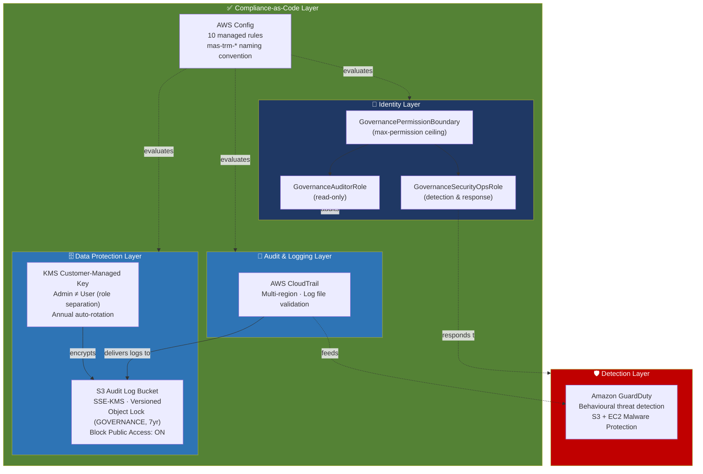

# 🔐 AWS Security Governance Baseline
### Project 1 of 4 — AWS Cloud Security Governance Portfolio


<<<<<<< HEAD
> A policy-as-code AWS security baseline — IAM permission boundaries, an encrypted/immutable audit-log store, continuous configuration compliance, threat detection, and key-management role separation — deployed entirely via CloudFormation and mapped explicitly against **13 global governance frameworks and compliance standards**.
=======
## Overview
A fully documented, Infrastructure-as-Code (IaC) deployed security baseline for a single AWS account. This project establishes core security guardrails—including IAM roles with permission boundaries, an encrypted and immutable S3 audit log bucket, AWS Config compliance rules, CloudTrail, GuardDuty, and KMS with enforced role separation [cite: 1]. Every deployed control is mapped explicitly to the Monetary Authority of Singapore Technology Risk Management (MAS TRM) framework, alongside 12 other global standards, demonstrating enterprise-grade regulatory compliance [cite: 1]. 

## How it Will Help the Business
This architecture provides automated, continuous compliance validation, drastically reducing manual audit overhead. By establishing strict access ceilings and tamper-proof audit trails, the business minimizes the risk of data exfiltration and configuration drift. It lays a foundational security posture that allows organizations—particularly financial institutions operating under strict jurisdictional regulations—to scale securely in the cloud without compromising agility.

## Why it's Important
Unchecked privilege escalation and untracked API activity are leading causes of cloud breaches. This baseline ensures that even if individual policies are misconfigured, maximum access is hard-capped. It guarantees that security and audit logs remain immutable for years, ensuring verifiable forensic evidence is always available during an incident or regulatory audit [cite: 1]. 

## Architecture Diagram
*(Include a visual architecture diagram here in the final repository)*
*   **Users/Roles:** `GovernanceAuditorRole`, `GovernanceSecurityOpsRole` interacting with boundaries [cite: 1].
*   **Logging:** Multi-region CloudTrail delivering SHA-256 validated logs to an S3 Bucket [cite: 1].
*   **Storage:** S3 Bucket with SSE-KMS, Object Lock (7-Year Governance Mode), and Public Access Block [cite: 1].
*   **Monitoring/Detection:** AWS Config (evaluating 10 managed rules) and Amazon GuardDuty (behavioral threat detection) [cite: 1].
*   **Cryptography:** KMS Customer Managed Key (CMK) separating Key Administrators from Key Users [cite: 1].

## Security Layers & Security Checks to Implement
*   **Identity Layer:** Least-privilege IAM roles governed by strict permission boundaries (`GovernancePermissionBoundary`) [cite: 1]. 
*   **Storage & Data Security Layer:** Amazon S3 configuration denying HTTP requests (TLS enforcement), blocking all public access, and forcing SSE-KMS encryption [cite: 1].
*   **Detection & Visibility Layer:** AWS Config for continuous compliance evaluation, multi-region CloudTrail with log file validation, and GuardDuty for behavioral anomaly detection [cite: 1].
*   **Cryptographic Layer:** Enforced Segregation of Duties (SoD) on KMS encryption keys, separating key management from decryption capabilities, mirroring strict enterprise database security principles [cite: 1].

## What You'll Build
*   IAM roles with permission boundaries mapping to MAS TRM 9.1.2 [cite: 1].
*   An encrypted, immutable S3 audit log bucket meeting MAS TRM 11.2 [cite: 1].
*   An AWS Config continuous evaluation setup with rules for MFA, S3 public access, KMS rotation, and IAM credential lifecycle [cite: 1].
*   A multi-region AWS CloudTrail with log integrity validation [cite: 1].
*   Amazon GuardDuty detectors spanning API activity and S3/EC2 protection [cite: 1].
*   A centralized AWS KMS Customer Managed Key demonstrating cryptographic role separation [cite: 1].

## Project Structure & Flow of the Project
```text
├── 01-governance-baseline/
│   ├── cloudformation/
│   │   ├── iam-roles.yaml           # IAM roles and boundaries [cite: 1]
│   │   ├── s3-audit-bucket.yaml     # Immutable log storage [cite: 1]
│   │   ├── config-rules.yaml        # MAS TRM aligned rules [cite: 1]
│   │   └── cloudtrail.yaml          # Audit trail configuration [cite: 1]
│   ├── docs/
│   │   └── mas-trm-control-mapping.md # 13-framework matrix [cite: 1]
│   ├── screenshots/                 # Validation artifacts [cite: 1]
│   └── README.md
└── .github/workflows/
    └── validate-p1.yml              # CI pipeline for cfn-lint [cite: 1]
```

## Implementation Steps
1.  **Deploy IAM Roles:** Apply permission boundaries to cap maximum privileges, followed by creating Auditor and SecOps roles [cite: 1].
2.  **Establish Secure Storage:** Deploy the S3 audit bucket with SSE-KMS, public access blocks, and 7-year Object Lock [cite: 1].
3.  **Enable Configuration Monitoring:** Activate AWS Config and deploy mapping rules via CloudFormation to evaluate resource compliance [cite: 1].
4.  **Activate Threat Detection:** Enable GuardDuty, configure S3/EC2 protection, and deploy multi-region CloudTrail [cite: 1].
5.  **Configure Cryptography:** Create a KMS key, update the key policy to separate administrators from users, and enable annual rotation [cite: 1].
6.  **CI/CD Validation:** Implement GitHub Actions with `cfn-lint` on feature branches to validate Infrastructure as Code prior to merges [cite: 1].

## Key Decisions to Document
*   **Permission Boundaries over Policies:** Chosen to establish an unbreachable permission ceiling, preventing future privilege creep [cite: 1].
*   **Object Lock 'GOVERNANCE' vs 'COMPLIANCE' Mode:** Governance mode selected for this baseline to allow highly audited, exceptional overrides, whereas Compliance mode is irreversible [cite: 1].
*   **KMS Segregation of Duties:** Ensuring the Key Administrator cannot decrypt data, and the Key User cannot manage the key lifecycle, preventing single points of cryptographic failure [cite: 1].
*   **CI/CD Pipeline Validation:** Enforcing `cfn-lint` on all pull requests ensures no malformed templates reach the environment [cite: 1].

## Security Considerations
*   **Key Principles and Characteristics:** Defense in depth, least privilege, immutable logging, and continuous compliance evaluation.
*   **Key Capabilities:** Tamper-proof forensic trails, automated drift detection, and behavioral anomaly flagging.
*   **Basic Components/Features:** CloudFormation (IaC), AWS Config (CSPM), CloudTrail (Audit), GuardDuty (Threat Detection).
*   **Prerequisites:** AWS Account (Free Tier viable), AWS CLI configured, GitHub repository for CI/CD setup [cite: 1].
*   **High-Level Workflow:** Code commit -> CI linting -> CFN Deployment -> Continuous Config Evaluation -> Audit Logging -> Threat Detection Alerting.

## Controls Mapping
| Framework / Standard | Portfolio Control / Evidence |
| :--- | :--- |
| **MAS TRM 2021** | Config root-MFA rule (§9.1.1), KMS SSE (§8.3), CloudTrail (§11.2) [cite: 1] |
| **ISO 27001** | IAM roles (A.5.15), KMS (A.8.24), CloudTrail (A.8.15) [cite: 1] |
| **NIST SP 800-53 (Rev.5)** | IAM account mgmt (AC-2), S3 Object Lock (AU-9), KMS (SC-12) [cite: 1] |
| **GDPR** | Encryption at rest/in transit (Art. 32), Access controls [cite: 1] |
| **PDPA** | SSE-KMS + Block Public Access on audit bucket [cite: 1] |

## Threats Mitigated
*   **Compromised Root Credentials:** Mitigated by MFA enforcement and Config alerting (T1078.004) [cite: 1].
*   **Accidental S3 Public Exposure:** Mitigated by Block Public Access & Deny-HTTP bucket policies (T1530) [cite: 1].
*   **Audit Log Tampering:** Mitigated by CloudTrail validation and S3 Object Lock (T1562.008) [cite: 1].
*   **Encryption Key Misuse:** Mitigated by KMS role separation and automated rotation [cite: 1].
*   **Configuration Drift:** Mitigated by AWS Config continuous evaluations [cite: 1].

## Trade-off Pointers
*   **Config Detection Lag:** AWS Config evaluates on a schedule, leading to slight detection lag. For near-real-time detection on critical resources, Amazon EventBridge should be paired with Config (addressed in future iterations) [cite: 1].
*   **Object Lock Flexibility vs Strictness:** Governance mode allows recovery from errors with special permissions, while Compliance mode offers stricter immutability but higher operational risk [cite: 1].

## Enterprise Scale & Alternate Solutions
*   **How it scales in Cloud (Enterprise Consideration):** In a production multi-account environment, these CloudFormation templates would be deployed via StackSets from the AWS Organizations management account, enforced as non-negotiable baselines via AWS Control Tower guardrails, with Config conformance packs generating unified compliance dashboards [cite: 1]. 
*   **Alternate Solutions & Comparison:** Terraform could replace CloudFormation for multi-cloud deployments. Third-party CSPMs (like Prisma Cloud or Wiz) could replace AWS Config for cross-cloud visibility, though native AWS tools offer tighter ecosystem integration at lower initial complexity.
*   **Compensating Controls:** If KMS CMKs are cost-prohibitive, AWS Managed Keys offer a baseline level of encryption, though lacking granular role separation. 

## Deliverables Checklist
- [x] CloudFormation templates (`iam-roles.yaml`, `s3-audit-bucket.yaml`, `config-rules.yaml`, `cloudtrail.yaml`) [cite: 1]
- [x] MAS TRM and multi-framework mapping document [cite: 1]
- [x] GitHub Actions validation pipeline (`.github/workflows/validate-p1.yml`) [cite: 1]
- [x] Verification screenshots demonstrating live enforcement [01-governance-baseline/screenshots]

## Questions to Answer in Documentation (Interview Prep)
**Q: Why use permission boundaries instead of just writing tighter IAM policies?**
A: A permission boundary acts as an absolute ceiling. It caps the maximum permissions a role can ever have, protecting against privilege creep introduced by other administrators later on—a capability standard policies cannot achieve [cite: 1].

**Q: Why GOVERNANCE mode Object Lock on the audit bucket, not COMPLIANCE mode?**
A: Compliance mode is completely immutable even to the root user, making it operationally risky for genuine mistakes. Governance mode prevents standard deletion but allows a narrowly-scoped IAM override in highly audited, exceptional cases [cite: 1].

**Q: What is the weakest control in this baseline, and how would you strengthen it?**
A: AWS Config relies on scheduled evaluations, creating a detection delay. To strengthen this, I would integrate EventBridge event-pattern rules for near-real-time detection of high-risk configuration changes [cite: 1].

## Reference Materials
*   [AWS CloudFormation Documentation](https://docs.aws.amazon.com/cloudformation/)
*   [Monetary Authority of Singapore (MAS) TRM Guidelines](https://www.mas.gov.sg/regulation/guidelines/technology-risk-management-guidelines)
*   [AWS Security Best Practices in IAM](https://docs.aws.amazon.com/IAM/latest/UserGuide/best-practices.html)
*   [Amazon S3 Object Lock](https://docs.aws.amazon.com/AmazonS3/latest/userguide/object-lock.html)
>>>>>>> 25348af8c68e301ac3de5251de3e3e5674aadf57

---

## Overview

This is the anchor project of a four-project AWS Cloud Security Governance portfolio. It deploys a complete, single-account security baseline for a financial-services-style AWS environment, entirely on AWS Free Tier, entirely as Infrastructure-as-Code.

Rather than treating "security baseline" as a checklist of services turned on, this project treats it as a **governance artefact**: every control is deployed with a named regulatory driver, every control has an evidence trail, and every control is mapped to the specific framework clause it satisfies. The goal is to demonstrate the way a Cloud Security Architect or Cloud Governance Lead actually thinks — regulatory requirement → control design → technical implementation → auditable evidence — not just "here are some AWS services I turned on."

**Author context:** Built by a 20-year enterprise security practitioner (IBM Guardium DAM, Tripwire FIM, enterprise IAM governance) transitioning that governance discipline into a native AWS control plane.

---

## How It Will Help the Business

| Business problem | How this project addresses it |
|---|---|
| Manual security reviews don't scale across accounts/regions | Every control is CloudFormation — repeatable, version-controlled, deployable via StackSets across an entire AWS Organization |
| Audit prep is slow and evidence-gathering is manual | Config + CloudTrail generate **continuous, automated compliance evidence** instead of point-in-time manual attestations |
| Regulatory scope keeps expanding (MAS TRM → GDPR → EU AI Act as firms go multi-jurisdiction) | Controls are mapped once, against 13 frameworks simultaneously, so expanding into a new jurisdiction is a mapping exercise, not a rebuild |
| Cloud misconfiguration remains one of the most common root causes of breach | Guardrails (permission boundaries, Block Public Access, mandatory encryption) prevent entire classes of misconfiguration by design, not by review |
| Security review is often a bottleneck to shipping | A CI-validated (`cfn-lint`) IaC baseline means new infrastructure changes are checked automatically before merge, not manually before launch |

---

## Why It's Important

Financial institutions operating out of Singapore sit at the intersection of **MAS TRM** (technology risk governance), **PDPA** (data protection), and increasingly **GDPR** and the **EU AI Act** if they serve EU customers or entities. A Cloud Security Architect in this space isn't hired to know one framework — they're hired to reconcile several at once, in code, with evidence a regulator or auditor can actually inspect.

This project is a deliberately concrete answer to the interview question *"do you have real hands-on cloud experience, or just certifications?"* — every control here was deployed, screenshotted, and mapped to a named clause, not described in the abstract.

---

## What You'll Build

- **IAM governance layer** — a `GovernancePermissionBoundary` managed policy + two least-privilege roles (`GovernanceAuditorRole`, `GovernanceSecurityOpsRole`)
- **Immutable audit-log store** — SSE-KMS encrypted S3 bucket, versioning enabled, **Object Lock (GOVERNANCE mode, 7-year retention)**, HTTP access explicitly denied
- **Compliance-as-code** — 10 AWS Config managed rules, each named and mapped to a specific MAS TRM clause
- **Threat detection** — Amazon GuardDuty with S3 Protection and EC2 Malware Protection enabled
- **Immutable audit trail** — multi-region AWS CloudTrail, log file validation enabled
- **Key management with role separation** — a customer-managed KMS key where the admin role cannot decrypt and the decrypt role cannot administer
- **Governance documentation** — a 13-framework control-mapping document, this README, and a GitHub Actions CI pipeline

---

## Architecture Diagram



*Diagram note: this is the account-level governance baseline — it deploys ahead of, and independently from, any application workload VPC. See [Security Considerations](#security-considerations) for explicit scope boundaries.*

---

## Security Layers / Security Checks Implemented

| Layer | Control | Check performed |
|---|---|---|
| **1. Identity** | Permission boundaries on every custom role | Config rule confirms no role exceeds the boundary; boundary caps effective permissions regardless of attached policy |
| **2. Privileged access** | Root account MFA | `ROOT_ACCOUNT_MFA_ENABLED` Config rule + CloudWatch alarm on root login |
| **3. Data at rest** | SSE-KMS on all audit data | `s3-bucket-server-side-encryption-enabled` Config rule |
| **4. Data in transit** | TLS-only bucket policy | `s3-bucket-ssl-requests-only` Config rule + explicit Deny-HTTP statement |
| **5. Data exposure** | Public access blocking | `S3_BUCKET_LEVEL_PUBLIC_ACCESS_PROHIBITED` Config rule, all 4 Block Public Access settings enabled |
| **6. Audit integrity** | Immutable, validated logs | CloudTrail log file validation + S3 Object Lock GOVERNANCE mode |
| **7. Key governance** | Segregation of duties on encryption | KMS key policy — admin principal excluded from `kms:Decrypt` |
| **8. Credential hygiene** | Access key rotation | `access-keys-rotated` Config rule, 90-day threshold |
| **9. Behavioural detection** | Anomaly/threat detection | GuardDuty across CloudTrail, VPC Flow, and DNS logs |
| **10. Configuration drift** | Continuous compliance evaluation | 10 AWS Config managed rules re-evaluated automatically on change |

---

## Project Structure / Flow of the Project

```
01-governance-baseline/
├── cloudformation/
│   ├── iam-roles.yaml           # Permission boundary + Auditor/SecurityOps roles
│   ├── s3-audit-bucket.yaml     # Encrypted, immutable audit-log bucket
│   ├── config-rules.yaml        # 10 managed Config rules, MAS TRM-mapped
│   └── cloudtrail.yaml          # Multi-region trail with log file validation
├── docs/
│   ├── mas-trm-control-mapping.md
│   └── kms-role-separation.md
├── screenshots/
│   ├── iam-roles.png
│   ├── iam-permission-boundary.png
│   ├── s3-encryption.png
│   ├── config-compliance-dashboard.png
│   ├── guardduty-active.png
│   ├── cloudtrail.png
│   └── kms-key-policy.png
└── README.md                    # This file

.github/workflows/
└── validate-p1.yml              # cfn-lint CI, runs on every push/PR to this folder
```

**Flow:** IAM roles/boundary deployed first (identity foundation) → S3 audit bucket + KMS key (where evidence lands) → CloudTrail (start generating evidence) → Config rules (start evaluating compliance) → GuardDuty (start detecting threats) → documentation (make it auditable) → CI (make it enforceable going forward).

---

## Implementation Steps

> Full click-by-click console steps and complete AWS CLI commands live in the portfolio build guide — this is the summary view for anyone reviewing the repo.

1. **Deploy IAM roles with permission boundaries** — `aws cloudformation deploy --template-file cloudformation/iam-roles.yaml --stack-name governance-iam-roles --capabilities CAPABILITY_NAMED_IAM`
2. **Deploy the encrypted, immutable S3 audit bucket** — SSE-KMS, versioning, Object Lock GOVERNANCE mode, deny-HTTP bucket policy
3. **Enable AWS Config and deploy 10 managed rules** — console-enabled recorder + `config-rules.yaml` stack
4. **Enable GuardDuty and CloudTrail** — 30-day GuardDuty trial + multi-region CloudTrail with log file validation
5. **Create the KMS key with role separation** — admin role manages the key, a separate role is granted decrypt-only
6. **Write the MAS TRM / 13-framework control-mapping document** — the artefact that turns this from a lab exercise into a governance deliverable
7. **Push via a feature branch + PR, gated by CI** — `cfn-lint` runs automatically before merge (see `.github/workflows/validate-p1.yml`)

---

## Key Decisions to Document

These are the design decisions worth being able to explain out loud — each one reflects a real trade-off, not an arbitrary choice:

- **Permission boundaries vs. tighter IAM policies** — a boundary is a ceiling, not a grant. It protects against privilege creep introduced by *other* administrators after the fact, which a well-written policy alone cannot.
- **Object Lock GOVERNANCE mode vs. COMPLIANCE mode** — GOVERNANCE allows a narrowly-scoped, audited override; COMPLIANCE is immutable even to root. Chose GOVERNANCE for a reversible portfolio deployment; flagged COMPLIANCE as the stronger choice for a production regulatory log store.
- **SSE-KMS vs. SSE-S3 encryption** — SSE-KMS was chosen specifically because it enables the role-separation control (a key policy with distinct admin/user principals). SSE-S3 offers encryption at rest but no equivalent access-segregation lever.
- **Console-enabled Config recorder vs. CloudFormation-managed recorder** — the guide explicitly avoids deploying a Config recorder via CloudFormation in a personal account, since it can conflict with a console-enabled recorder. Documenting *why* a more "IaC-pure" approach was deliberately not used is itself a governance decision worth recording.
- **Single-account Free Tier scope vs. multi-account production reality** — this project intentionally stays inside one account; the enterprise-scale path (StackSets, Control Tower, Config conformance packs) is documented rather than built, since building it would require an AWS Organization outside Free Tier scope.

---

## Security Considerations

- **Root account is never used for daily work** — MFA-enforced, credentials rotated out, `portfolio-admin` IAM user used instead.
- **Least privilege is enforced structurally, not just by policy wording** — permission boundaries mean a mis-scoped attached policy still can't exceed the ceiling.
- **Blast radius reduction** — the Auditor and SecurityOps roles are scoped to read-only / detection-response actions respectively; neither can modify the audit trail.
- **Immutability of evidence** — Object Lock + CloudTrail log file validation together mean tampering is both prevented (Lock) and detectable (validation hash chain) if attempted.
- **Explicit scope boundary — what this project does *not* cover:** this is an **account-level governance baseline**, not workload/network security. There is no VPC, no application layer, and no runtime workload protection in this project — that's a deliberate scope decision, not an oversight. Network and workload controls would sit in a separate project layered on top of this baseline.
- **Detection lag is a known, documented limitation** — AWS Config evaluates on a schedule, not in real time. This is explicitly called out (see [Trade-off Pointers](#trade-off-pointers)) and addressed by pairing this baseline with EventBridge real-time detection in Project 2.

---

## Controls Mapping

*Mapped against 13 frameworks and standards. Where a framework has no genuine bearing on this project, that's stated explicitly rather than forced — this project has no AI component, so the AI-specific standards are marked not applicable.*

| Framework / Standard | Reference | Portfolio control / evidence |
|---|---|---|
| MAS TRM 2021 | §9.1.1 MFA, §8.3 encryption, §11.2 logging | Config root-MFA rule, KMS SSE, CloudTrail |
| ISO 27001 | Annex A 5.15, 8.24, 8.15 | IAM roles, KMS, CloudTrail |
| PDPA | Protection Obligation (security arrangements) | SSE-KMS + Block Public Access on audit bucket |
| NIST SP 800-53 Rev.5 | AC-2, AU-9, SC-12/SC-13, CM-6 | IAM account mgmt, S3 Object Lock, KMS, Config |
| NIST CSF 2.0 | PROTECT: PR.AA, PR.DS | IAM permission boundaries + KMS encryption |
| GDPR | Art.32 security of processing, Art.5(1)(f) | Encryption at rest/in transit, access controls |
| ISO 27002 | 5.15 Access control, 8.24 Cryptography, 8.15 Logging | IAM, KMS, CloudTrail |
| ISO 27017 | CLD.9.5.1 segregation, CLD.12.4.5 monitoring | KMS role separation, Config compliance monitoring |
| ISO 27018 | 11.1 PII retention/disposal in logs | S3 Object Lock retention policy, lifecycle rules |
| MAS FEAT | Not applicable | No AI system in scope for this project |
| NIST AI RMF | Not applicable | No AI system in scope for this project |
| ISO 42001 | Not applicable | No AI management system in scope for this project |
| EU AI Act | Not applicable | No AI system in scope for this project |

---

## Threats Mitigated

*Tagged against MITRE ATT&CK (Enterprise/Cloud matrix).*

| Threat scenario | ATT&CK reference | Mitigating control |
|---|---|---|
| Compromised or misused root credentials | TA0004 / T1078.004 Valid Accounts: Cloud Accounts | MFA enforcement + Config root-MFA rule + login alarm |
| Accidental or malicious S3 public exposure | TA0009 / T1530 Data from Cloud Storage | S3 Block Public Access + Config public-access rule + deny-HTTP policy |
| Audit log tampering or deletion to cover tracks | TA0005 / T1562.008 Impair Defenses: Disable Cloud Logs | CloudTrail log file validation + S3 Object Lock (GOVERNANCE, 7yr) |
| Encryption key misuse or unauthorised decrypt | TA0006 Credential Access (key misuse) | KMS role separation (admin ≠ user) + annual rotation |
| Configuration drift introducing unnoticed gaps | TA0005 Defense Evasion (config weakening) | AWS Config continuous evaluation, 10 managed rules |
| Undetected anomalous account activity | General reconnaissance / lateral movement | Amazon GuardDuty behavioural detection |

---

## Trade-off Pointers

Honest architectural trade-offs — the kind of thing that separates "I deployed some services" from "I understand the design space":

- **Config's scheduled evaluation vs. real-time detection** — Config catches drift but with a lag; it's paired with EventBridge (Project 2) for near-real-time detection of the highest-risk changes. Config = breadth, EventBridge = speed.
- **Broad managed policies + a permission boundary vs. hand-written granular policies** — using AWS managed policies (`SecurityAudit`, `ReadOnlyAccess`) inside a boundary trades some precision for maintainability; the boundary is what keeps the trade-off safe.
- **GOVERNANCE vs. COMPLIANCE Object Lock** — reversibility vs. absolute immutability; the right answer depends on whether you can tolerate zero operator error against the value of being able to correct a mistake.
- **Single AWS account (Free Tier) vs. AWS Organization / multi-account** — this project simplifies to fit Free Tier constraints; production scale requires StackSets, Control Tower guardrails, and Config conformance packs, all documented but not built here.
- **cfn-lint static validation only, no deploy-from-CI** — CI never holds AWS credentials. This trades "fully automated deployment" for "zero long-lived cloud credentials in a public repository's CI pipeline" — a deliberate security-over-convenience choice.

---

## Deliverables Checklist

- [ ] `iam-roles.yaml` deployed — stack status `CREATE_COMPLETE`
- [ ] `s3-audit-bucket.yaml` deployed — SSE-KMS, versioning, Object Lock all confirmed in console
- [ ] AWS Config enabled + 10 managed rules deployed and evaluated
- [ ] CloudTrail multi-region trail created, log file validation confirmed
- [ ] GuardDuty enabled, sample findings generated and reviewed, then suspended to avoid post-trial cost
- [ ] KMS key created with documented role separation (admin ≠ decrypt user)
- [ ] 7 screenshots captured, account ID and ARNs redacted (see redaction checklist)
- [ ] `mas-trm-control-mapping.md` / 13-framework mapping doc written
- [ ] `.github/workflows/validate-p1.yml` created and passing (green check on PR)
- [ ] This README completed and committed
- [ ] Feature branch → PR → CI green → squash-merged into `main`
- [ ] LinkedIn post published
- [ ] Resume bullets added to CV
- [ ] All 5 interview Q&A pairs rehearsed out loud

---

## Questions to Answer in Your Documentation

If your README and docs can answer these clearly, you're ready to defend this project in an interview:

**Q: Why permission boundaries instead of just writing tighter IAM policies?**
A permission boundary is a ceiling, not a grant — it caps the maximum permissions a role can ever have, even if someone later attaches a broader managed policy to it. That protects against privilege creep introduced by other administrators after the fact, which a well-written policy alone can't do.

**Q: Why GOVERNANCE mode Object Lock on the audit bucket, not COMPLIANCE mode?**
COMPLIANCE mode is immutable even to the root account for the retention period — safer against tampering, riskier operationally. GOVERNANCE mode still blocks ordinary deletion but allows a narrowly-scoped, audited override. Chose the reversible option for a portfolio project; would weigh COMPLIANCE more seriously for a production regulatory log store.

**Q: How would you scale this baseline to 50 AWS accounts?**
Deploy the same CloudFormation templates as StackSets from the management account, enforce them as non-negotiable guardrails through AWS Control Tower, and use Config conformance packs to generate consolidated compliance evidence across every account for audit submissions.

**Q: What's the weakest control in this baseline, and how would you strengthen it?**
AWS Config evaluates on a schedule, not in real time, so there's a detection lag between a misconfiguration occurring and Config flagging it. Paired with EventBridge event-pattern rules in Project 2 for near-real-time detection of the highest-risk changes.

**Q: How does this map to ISO 27001 certification evidence in practice?**
Each Annex A control needs an auditable evidence trail, not just a policy statement. CloudTrail and Config both generate that evidence continuously and automatically — A.8.15 (logging) is evidenced by the CloudTrail configuration and log file validation status, not a manual log-review spreadsheet.

---

## Reference Materials

**AWS documentation**
- [IAM Permission Boundaries](https://docs.aws.amazon.com/IAM/latest/UserGuide/access_policies_boundaries.html)
- [Amazon S3 Object Lock](https://docs.aws.amazon.com/AmazonS3/latest/userguide/object-lock-managing.html)
- [AWS Config — What Is AWS Config](https://docs.aws.amazon.com/config/latest/developerguide/WhatIsConfig.html)
- [AWS CloudTrail User Guide](https://docs.aws.amazon.com/awscloudtrail/latest/userguide/cloudtrail-user-guide.html)
- [Amazon GuardDuty User Guide](https://docs.aws.amazon.com/guardduty/latest/ug/what-is-guardduty.html)
- [AWS KMS Developer Guide](https://docs.aws.amazon.com/kms/latest/developerguide/overview.html)
- [AWS CloudFormation User Guide](https://docs.aws.amazon.com/AWSCloudFormation/latest/UserGuide/Welcome.html)

**Regulatory & framework sources**
- [MAS Technology Risk Management Guidelines (2021)](https://www.mas.gov.sg/regulation/guidelines/technology-risk-management-guidelines)
- [PDPA Overview — PDPC Singapore](https://www.pdpc.gov.sg/overview-of-pdpa/the-legislation/personal-data-protection-act)
- [NIST SP 800-53 Rev. 5](https://csrc.nist.gov/pubs/sp/800/53/r5/upd1/final)
- [NIST Cybersecurity Framework 2.0](https://www.nist.gov/cyberframework)
- [ISO/IEC 27001](https://www.iso.org/standard/27001)
- [MITRE ATT&CK — Cloud Matrix](https://attack.mitre.org/matrices/enterprise/cloud/)

---

## About This Portfolio

This is Project 1 of a 4-project AWS Cloud Security Governance portfolio:

| # | Project | Focus |
|---|---|---|
| **1** | **Security Governance Baseline** *(this repo)* | Policy-as-code IAM, encryption, compliance, detection |
| 2 | Threat Detection & Alerting Pipeline | EventBridge/CloudWatch real-time detection, IR runbooks |
| 3 | IAM Governance & Access Analysis | Access Analyzer, credential review, enterprise-IAM bridge |
| 4 | AI Governance Framework (Bedrock) | AI risk register, guardrails policy, EU AI Act / ISO 42001 mapping |

**Author:** Arun Kumar — Cloud Security & IAM Professional, 20 years enterprise security (IBM Guardium DAM, Tripwire FIM, enterprise IAM governance) transitioning into Cloud Security Architect / Cloud Governance Lead roles.
