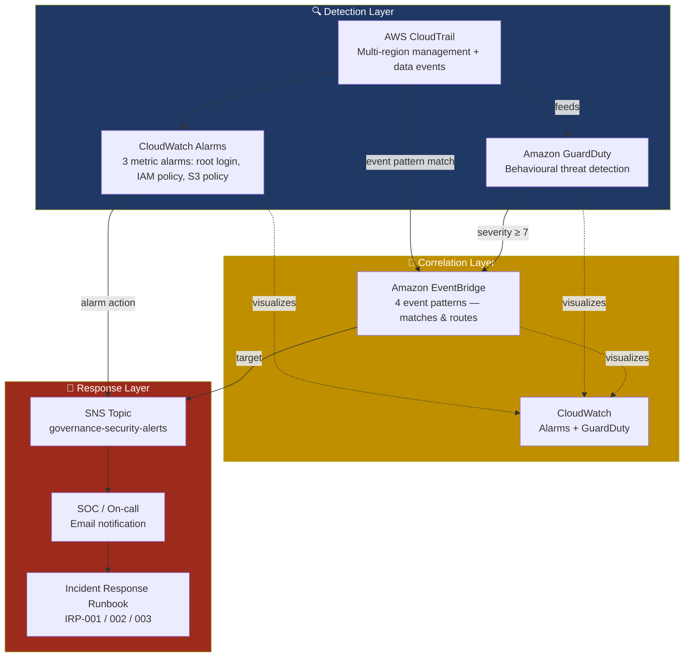

# 🔍 Automated Threat Detection & Alerting Pipeline
### Project 2 of 4 — AWS Cloud Security Governance Portfolio


> A real-time threat detection and alerting pipeline — EventBridge, CloudWatch Alarms, and SNS, layered on the Project 1 governance baseline — built as a response to named threat scenarios (unauthorized IAM changes, suspicious API calls, live misconfigurations), not as a services checklist. Every alert maps to a written runbook and a regulatory notification clock.

---

## Executive Summary

Project 1 answered *"is this account configured correctly?"* — on a schedule. This project answers the question that matters between those evaluation cycles: *"did something bad just happen, and does anyone know yet?"*

It is an automated detection pipeline covering the four highest-risk event patterns identified from this portfolio's own threat model — root account login, IAM access key creation, S3 public-access changes, and high-severity GuardDuty findings — routed to a notification channel within **60 seconds to low minutes** of occurrence, backed by three written incident-response runbooks that define exactly what happens next. It is organised into three deliberately separate layers — **Detection, Correlation, Response** — because conflating them is how detection pipelines become either too noisy to trust or too rigid to extend.

**Author context:** Built by a 20-year enterprise security practitioner (IBM Guardium DAM, Tripwire FIM, enterprise IAM governance) extending Project 1's governance baseline into a real-time detection and response capability.

---

## The Problem

Cloud environments generate a continuous stream of API activity. A root login, a new IAM access key, and a routine S3 read look identical in volume — the difference between "normal" and "incident" is entirely in the pattern, not the raw event. Without something watching for specific high-risk patterns, that difference is invisible until someone goes looking for it.

This isn't a hypothetical framing. The **Cloud Security Alliance's Top Threats to Cloud Computing (2024)** report — the industry's most cited ranked threat research for cloud environments — places **Misconfiguration and Inadequate Change Control at #1** and **Identity and Access Management at #2** out of eleven ranked threats, with Limited Cloud Visibility and Observability entering as a new top-ten threat. Those three findings describe this project's problem statement almost exactly.

**The specific gap this project closes:**
- AWS Config (Project 1) evaluates compliance on a schedule — useful for drift detection, not for "this just happened, respond now."
- CloudTrail records every API call, but a log nobody is actively watching is a forensic record, not a detection control.
- GuardDuty generates high-quality behavioural findings, but a finding that sits unopened in the console isn't an alert — it's a report waiting to be read.

---

## How It Will Help the Business

| Business problem | How this project addresses it |
|---|---|
| High-risk events go unnoticed between Config's evaluation cycles | EventBridge + CloudWatch Alarms close the gap with 60-second-to-low-minute detection on named threat scenarios |
| Regulatory notification clocks (MAS TRM 1-hour, GDPR 72-hour) start at *awareness*, not at discovery | Near-real-time detection means the clock starts when the event happens, not days later during a manual review |
| Inconsistent incident response depending on who's on call | Three written runbooks (IRP-001/002/003) mean the response doesn't depend on institutional memory |
| Alert fatigue makes teams ignore monitoring tools | Severity-filtered GuardDuty routing (≥7 only) and single-purpose EventBridge rules — no broad heuristics needing constant tuning |
| "We have monitoring" claims that don't survive scrutiny | Coverage is stated as a number against a named benchmark (Section on Controls Mapping), with gaps documented, not hidden |

---

## Why It's Important

A Cloud Security Architect isn't hired to turn on GuardDuty and call it done — they're hired to build a pipeline that catches the right things, routes them to the right people, and gives those people a plan. This project is the concrete answer to *"walk me through what happens when someone logs into root"* — an answer with a real latency number, a real alert path, and a real runbook, not a description of what GuardDuty theoretically does.

---

## What You'll Build

- **Detection layer** — 3 CloudWatch Alarms (root login, IAM policy change, S3 bucket policy change) + GuardDuty behavioural detection, layered on Project 1's CloudTrail and Config
- **Correlation layer** — 4 EventBridge event-pattern rules that match specific high-risk API calls and route them, plus a consolidating Alarms + GuardDuty + a live Logs Insights query into one screen
- **Response layer** — an SNS topic delivering notifications, and three incident-response runbooks (IRP-001/002/003/004) defining confirm → contain → rollback → evidence-preservation steps with regulatory clocks built in
- **Governance documentation** — 13-framework control mapping led by CIS AWS Foundations Benchmark, NIST CSF 2.0, ISO 27001, and MAS TRM 2021, plus this README and a GitHub Actions CI pipeline

---

## Architecture Diagram



*Diagram note: CloudWatch Alarms and EventBridge are not interchangeable — Alarms are threshold-based over a metric stream, EventBridge matches discrete API events regardless of volume. This pipeline uses both deliberately. See [Key Decisions](#key-decisions-to-document).*

---

## Detection, Correlation & Response Maturity

This section exists because "we have alerting" means very different things depending on maturity level. Mapping this project against a simple four-level model:

| Level | Capability | Where it lives in this portfolio |
|---|---|---|
| **1 — Visibility** | You can see what happened, after the fact | Project 1: CloudTrail logging, Config compliance snapshots |
| **2 — Detection** | You're told something happened, close to when it happened | This project: CloudWatch Alarms (≤60s–5min), GuardDuty behavioural findings |
| **3 — Correlation** | Related signals are matched and routed automatically, not manually pieced together | This project: EventBridge pattern matching, single-pane CloudWatch|
| **4 — Response** | A human has a pre-agreed plan, and regulatory obligations are tracked automatically | This project: IRP-001/002/003 runbooks, MAS TRM/GDPR clocks embedded in the response procedure |

**What's honestly still missing for Level 5 (automated remediation):** no SOAR-style auto-response, no ticketing integration, no 24/7 rotation. Every response action in this pipeline is human-executed against a runbook. That's a stated scope boundary (see [Trade-off Pointers](#trade-off-pointers)), not an oversight.

---

## Project Structure / Flow of the Project

```
02-detection-pipeline/
├── cloudformation/
│   ├── cloudwatch-alarms.yaml   # 3 alarms + SNS topic
├── eventbridge-rules/
│   ├── rule-root-login.json
│   ├── rule-iam-access-key-created.json
│   ├── rule-s3-public-access.json
│   └── guardduty-high-severity.json
├── runbooks/
│   ├── IRP-001-iam-access-key-created.md
│   ├── IRP-002-root-login.md
│   ├── IRP-003-s3-public-access.md
│   └── IRP-004-guardduty-findings.md
├── screenshots/
│   ├── eventbridge-rule.png
│   ├── cloudwatch-alarms.png
│   ├── sns-topics.png
│   ├── aws-email-notifications.png
│   └── guardduty-findings.png
└── README.md                    # This file

.github/workflows/
└── validate-p2.yml              # cfn-lint + EventBridge JSON validation on every push/PR
```

**Flow:** CloudTrail (Project 1) generates the raw signal → CloudWatch Alarms and EventBridge both consume it independently → GuardDuty layers behavioural detection on top → EventBridge routes matched patterns and GuardDuty's severity-filtered findings to SNS → SNS notifies a human → the human follows a runbook, which starts the relevant regulatory clock.

---

## Technical Approach — High‑Level Steps

- **CloudWatch Alarms: Create CloudWatch alarms (via CloudFormation or Console) that monitor CloudTrail‑derived metrics like RootLoginCount, IAMPolicyChanges, and S3BucketPolicyChanges, and attach them to an SNS topic (confirm the email subscription) for immediate SOC notification.
- **EventBridge Rules: Define EventBridge rules with targeted event patterns (root sign‑ins, IAM API calls, S3 public‑access changes, GuardDuty high‑severity findings) and route matched events to the governance-security-alerts SNS topic for correlation and fan‑out.
- **Security Dashboard: Build a CloudWatch dashboard named Security‑Governance‑Portfolio that aggregates alarm status, AWS Config NonCompliantRules count, GuardDuty finding counts, and a CloudTrail Logs Insights query for recent high‑risk events.
- **CI and Validation: Add a GitHub Actions workflow to lint CloudFormation templates and validate EventBridge JSON on PRs so changes are tested and gated before deployment.
- **Testing and Validation: Validate end‑to‑end in a non‑production account by generating safe test events or using sample findings to confirm metric emission, EventBridge matches, SNS delivery, and dashboard updates.
---

## Sample Alerts and Incident Response Playbooks

The operational core of this project — not just what fires, but what a responder does when it does.

### 🔴 Playbook: IRP-001: IAM Access Key Created
> **Trigger:** `SECURITY-iam-policy-change-detected` alarm fires, or the IAM-key-creation EventBridge rule matches
> **Detection layer:** CloudWatch Alarm (metric filter) + EventBridge (event pattern)
> **Alert path:** CloudWatch Alarm → SNS → email to on-call within 5 minutes
> **Immediate action:** Confirm the change against the approved change calendar. No matching ticket → treat as unauthorized.
> **Rollback:** Compare against the last-known-good IAM policy version; re-attach via `aws iam set-default-policy-version`; disable the key/session if attached to a suspicious principal.
> **Escalation:** Security Architect → CISO if privilege escalation is suspected (e.g. `AdministratorAccess` added, or a permission boundary removed).
> **Regulatory clock:** MAS TRM Section 13 (1-hour internal threshold) starts at detection.

### 🔴 Playbook: IRP-002: Root Account Login Detected
> **Trigger:** `SECURITY-root-login-detected` alarm fires (Period=60s)
> **Detection layer:** CloudWatch Alarm on the CloudTrail root-login metric
> **Alert path:** SNS → email — P1-critical by definition, since root bypasses every IAM permission boundary and SCP from Project 1
> **Immediate action:** Confirm via CloudTrail (`userIdentity.type=Root`); check source IP against known corporate ranges; escalate immediately if unrecognised.
> **Rollback:** Rotate root password; revoke active root access keys; preserve CloudTrail logs for the session window.
> **Escalation:** Security Architect → CISO → Legal if data exposure is confirmed.
> **Regulatory clock:** MAS TRM 1-hour threshold if customer data or critical systems were accessed.

### 🔴 Playbook: IRP-003: S3 Public Access Change
> **Trigger:** EventBridge S3 rule matches `PutBucketPublicAccessBlock`, `DeletePublicAccessBlock`, or `PutBucketAcl`
> **Detection layer:** EventBridge — typically single-digit seconds after CloudTrail delivers the event
> **Alert path:** EventBridge → SNS — treated as a live data-exposure event, not a future risk (CSA's #1-ranked cloud threat)
> **Immediate action:** Immediately re-apply S3 Block Public Access; identify who/what made the change and why.
> **Rollback:** Restore the bucket policy to last-known-good; if the bucket held sensitive data, treat as a potential breach pending investigation.
> **Escalation:** Security Architect → Data Protection Officer if personal data may have been exposed.
> **Regulatory clock:** GDPR Art.33 (72-hour) and PDPA mandatory notification clocks start at detection if personal data exposure is confirmed.

### 🟠 Playbook: Suspicious API Call Pattern (GuardDuty severity ≥ 7)
> **Trigger:** EventBridge rule matches any GuardDuty finding with severity ≥ 7
> **Detection layer:** GuardDuty (behavioural) → EventBridge (severity filter — avoids alert fatigue by design)
> **Alert path:** EventBridge → SNS — severity filtering means every alert that reaches a human is worth their attention
> **Immediate action:** Review the finding type and affected resource; correlate against the Dashboard's Logs Insights query for the same window.
> **Rollback:** Depending on finding type — revoke the affected credential/session, isolate the instance's security group, or block the source IP.
> **Escalation:** Security Architect; CISO if the finding indicates likely credential compromise rather than a false positive.
> **Regulatory clock:** Assessment-dependent — MAS TRM 1-hour clock starts if confirmed genuine.

---

## Key Decisions to Document

- **EventBridge vs. CloudWatch Alarms — not interchangeable.** EventBridge matches discrete API events regardless of volume; Alarms are threshold-based over a metric stream. This pipeline uses both deliberately: EventBridge for significant single events, Alarms for anything needing a threshold.
- **Severity-filtering GuardDuty at the source (≥7 only), not forwarding everything.** A direct response to alert-fatigue risk — forwarding every finding makes the highest-confidence ones indistinguishable from noise.
- **Runbooks written before rules were tuned.** A rule that fires without a pre-agreed response just moves the ambiguity downstream to whoever is on call at 2am — the runbook is the more important artefact, even though the rule is the more demoable one.
- **CI validates JSON and CloudFormation only, never deploys.** Same design principle as Project 1 — no AWS credentials stored in GitHub Actions, trading full CI/CD automation for zero long-lived cloud credentials in a public repo.
- **CloudWatch Dashboard is a visibility layer, not part of the alert-firing path.** Alarms and EventBridge notify independently of the dashboard; the dashboard exists so an analyst isn't context-switching across four consoles mid-incident, not to gate any alert.

---

## Security Considerations

- **This pipeline detects and notifies — it does not remediate automatically.** Every rollback/containment action in the playbooks above is human-executed. No SOAR, no auto-remediation Lambda. Stated plainly, not implied to be more mature than it is.
- **False-positive rate is untested at production scale.** All 7 detection paths (3 alarms + 4 EventBridge rules) match a single, specifically-named event or a severity-filtered threshold — a structurally low false-positive design — but that's a design characteristic, not a measured rate, since this portfolio has no production traffic volume to tune against.
- **No alert deduplication.** A noisy period could generate multiple related alerts for the same root-cause activity; there's no correlation-of-correlations layer yet.
- **Single AWS account, Free Tier scope.** Production deployment would need Security Hub aggregation across an AWS Organization, not one account's EventBridge bus.
- **Detection latency numbers are architecturally verified, not production-measured** — see [Measurable Outcomes](#measurable-outcomes) for exactly what that means and why it matters.

---

## Controls Mapping

### Primary frameworks

**CIS AWS Foundations Benchmark v3.0.0** *(cited via AWS Security Hub's `[CloudWatch.N]` control IDs — more stable than the benchmark document's own section numbers, which have shifted across CIS versions)*

| Control | Requirement | Implementation |
|---|---|---|
| `[CloudWatch.1]` | Log metric filter/alarm for root user usage | `SECURITY-root-login-detected` alarm (Period=60s) |
| `[CloudWatch.4]` | Log metric filter/alarm for IAM policy changes | `SECURITY-iam-policy-change-detected` alarm (Period=300s) |
| `[CloudWatch.8]` | Log metric filter/alarm for S3 bucket policy changes | `SECURITY-s3-bucket-policy-change` alarm + EventBridge S3 rule |
| `[CloudWatch.2]` | Log metric filter/alarm for unauthorized API calls | Not a literal metric-filter match — covered in intent by GuardDuty + severity-filtered EventBridge rule |

**NIST Cybersecurity Framework 2.0**

| Function : Category | Requirement | Implementation |
|---|---|---|
| DETECT: DE.AE | Anomalies and events are detected | GuardDuty + EventBridge pattern matching |
| DETECT: DE.CM | Continuous monitoring | CloudWatch Alarms + Dashboard |
| RESPOND: RS.AN | Analysis | Runbook investigation steps + Logs Insights query |
| RESPOND: RS.CO | Communication | SNS notification + defined escalation paths |

**ISO/IEC 27001:2022** — Annex A 5.24–5.28 (incident management planning, assessment, response, learning, evidence collection) → runbooks IRP-001/002/003, each covering all five clauses end to end.

**MAS TRM 2021** — §9.1/9.1.3 (privileged access monitoring), §10.1 (incident management), §12.1 (security monitoring), Section 13 (MAS notification) → root/IAM detection, EventBridge + runbooks, GuardDuty + Dashboard, 1-hour clock in every runbook.

<details>
<summary><strong>Extended mapping — remaining 9 portfolio standards</strong></summary>

| Framework / Standard | Reference | Portfolio control / evidence |
|---|---|---|
| PDPA | Mandatory Data Breach Notification Obligation | Runbook documents notification triggers/timelines |
| NIST SP 800-53 Rev.5 | SI-4, IR-4, IR-6, AU-6 | GuardDuty, EventBridge, CloudWatch, runbooks |
| GDPR | Art.33 — 72-hour breach notification | Runbook timeline discipline; near-real-time detect-to-alert |
| ISO 27002 | 5.24–5.28 incident management, 8.16 monitoring | EventBridge rules, CloudWatch alarms |
| ISO 27017 | CLD.16.1 cloud incident management extension | Cloud-native detection pipeline |
| ISO 27018 | Breach notification to cloud customer/controller | Runbook escalation step to CISO/data controller |
| MAS FEAT | Not applicable | No AI system in scope for this project |
| NIST AI RMF | Not applicable | No AI system in scope for this project |
| ISO 42001 | Not applicable | No AI management system in scope |
| EU AI Act | Not applicable | No AI system in scope for this project |

</details>

---

## Threats Mitigated

| Threat scenario | ATT&CK reference | Mitigating control |
|---|---|---|
| Delayed detection of root misuse extends the attacker's window | TA0004 / T1078.004 Valid Accounts: Cloud Accounts | EventBridge root-login rule + CloudWatch alarm, ≤60s |
| Silent creation of IAM access keys for persistence | TA0003 / T1098 Account Manipulation | EventBridge `CreateAccessKey` rule |
| S3 bucket exposed via policy/ACL change goes unnoticed | TA0009 / T1530 Data from Cloud Storage | EventBridge S3 public-access-change rule |
| High-severity finding lost in alert noise | General detection-evasion-by-volume risk | Severity ≥7 filter routes only critical GuardDuty findings |
| Ad hoc response misses regulatory notification deadlines | N/A — process risk, not an attack technique | Runbooks with MAS 1-hour and GDPR 72-hour timelines built in |

---

## Measurable Outcomes

> **Methodology, stated up front:** this is a portfolio engineering environment, not a live production SOC with a year of incident history. The numbers below are **architecturally-verified engineering targets** — calculated directly from the deployed CloudFormation configuration and AWS's documented event-delivery behaviour — not measured production KPIs. Every figure shows its derivation so it can be defended, not just quoted, in an interview.

### Detection latency

| Mechanism | Latency | Source of the number |
|---|---|---|
| Root login alarm | ≤ 60 seconds | CloudFormation `Period=60, EvaluationPeriods=1` — read directly from the deployed template |
| IAM policy / S3 policy change alarms | ≤ 5 minutes | CloudFormation `Period=300, EvaluationPeriods=1` |
| EventBridge rules (all 4 patterns) | Typically single-digit seconds | AWS-documented near-real-time event delivery; stated as "typically," not a numbered SLA |

### Coverage — calculated against CIS AWS Foundations Benchmark v3.0.0's 14 monitoring controls

- **3 of 14** CIS-recommended monitoring controls implemented directly (root usage, IAM policy changes, S3 policy changes) = **21%** of the full CIS monitoring section by control count.
- **4 of 4** threat scenarios identified in this project's own risk assessment have dedicated, working detection = **100%** coverage of prioritized in-scope scenarios.
- Remaining 10 CIS controls (MFA sign-in, CloudTrail config changes, console auth failures, CMK deletion, Config changes, security groups, NACLs, gateways, route tables, VPC changes) are explicitly **next-iteration scope**, not silently missing.

### Mean time to detect (MTTD) — illustrative comparison, not a measured before/after

| | Baseline (no automated detection) | With this pipeline |
|---|---|---|
| Assumption | Manual CloudTrail/IAM review, once every 24 hours — realistic for a small team without dedicated SOC tooling | ≤60s (alarm-covered) to low-minutes (EventBridge-covered) |
| Calculation | 24 hours = 1,440 minutes worst-case latency | 1 minute (root login, worst case within the alarm's evaluation period) |
| **Result** | | **1,439 / 1,440 = 99.9% reduction** in worst-case detection latency for the alarm-covered scenario, against the stated 24-hour baseline assumption |

### False-positive minimization — a design characteristic, not a measured rate

**7 of 7** detection paths (3 alarms + 4 EventBridge rules) match a single, specifically-named event type or a severity-filtered threshold — **zero** broad/heuristic rules that would need post-hoc tuning. This is a structural claim verifiable in the rule definitions themselves. A measured false-positive *rate* would require production traffic volume this portfolio doesn't have — that gap is named in Security Considerations, not glossed over.

---

## Trade-off Pointers

- **EventBridge vs. CloudWatch Alarms** — not a choice, a deliberate pairing. Alarms for thresholds, EventBridge for discrete high-value events.
- **Severity-filtered GuardDuty routing vs. forwarding everything** — trades completeness for signal quality; a finding below severity 7 still exists in the GuardDuty console, it just doesn't page anyone.
- **Human-executed runbooks vs. SOAR auto-remediation** — this pipeline detects and notifies well; it doesn't act on a human's behalf. That's a stated scope boundary given the Free Tier / portfolio timeframe, not a hidden gap.
- **21% CIS monitoring coverage, stated honestly, vs. implying full coverage** — every security programme has to prioritize; naming the other 79% as a roadmap is what separates a real risk picture from a marketing claim.
- **No alert deduplication** — accepted for a single-account portfolio scope; would need addressing before this pattern scales to a multi-account Security Hub deployment.

---

## Deliverables Checklist

- [ ] `cloudwatch-alarms.yaml` deployed — 3 alarms + SNS topic, subscription confirmed
- [ ] All 4 EventBridge rules created and verified `ENABLED` (`aws events list-rules`)
- [ ] CloudWatch Dashboard created with all 4 widgets (alarms, Config, GuardDuty, Logs Insights)
- [ ] 3 incident-response runbooks written (IRP-001/002/003)
- [ ] Screenshots captured — EventBridge rules, CloudWatch alarms, GuardDuty findings, sns topics config, AWS email notifications (account ID redacted)
- [ ] `.github/workflows/validate-p2.yml` created and passing (green check on PR)
- [ ] This README completed and committed
- [ ] Feature branch → PR → CI green → squash-merged into `main`
- [ ] LinkedIn post published (continuation of Project 1's post)

---

## Questions to Answer in Your Documentation

**Q: Why EventBridge instead of just CloudWatch Alarms for everything?**
They solve different problems. EventBridge matches discrete, meaningful API events as they happen, regardless of volume. CloudWatch Alarms are threshold-based over a metric stream, better suited to statistical conditions. I use them together deliberately.

**Q: Walk me through what happens end-to-end when someone logs in as root.**
CloudTrail records the sign-in event, the CloudWatch alarm evaluates within 60 seconds, the alarm action targets SNS, and the on-call person gets an email. They follow runbook IRP-001: confirm the source IP, decide if it's authorised, and if not, rotate credentials and start the MAS/GDPR notification clock immediately.

**Q: Your CIS coverage number is 21% — isn't that a weakness to admit?**
It would be a weakness to hide it. Every security programme has to prioritize, and I can explain exactly why these 3 controls came first — they map to CSA's top two ranked cloud threats industry-wide. Naming the other 10 as a documented roadmap, rather than implying complete coverage, is what I'd want to see from someone reporting to me.

**Q: What's missing from this compared to a production-grade SOC?**
Automation of the response itself — this detects and notifies a human well; there's no SOAR-style auto-remediation, no ticketing integration, no 24/7 rotation. It's the detection and documented-process layer, not a full incident-management platform.

**Q: How does this operationally satisfy GDPR's 72-hour breach notification requirement?**
The 72 hours starts when the organisation becomes *aware* of a breach — so detection speed matters as much as the notification process. Near-real-time detection means the clock starts almost immediately rather than being discovered days later, and the runbook's investigation steps are scoped to fit comfortably inside that window.

---

## Reference Materials

**AWS documentation**
- [Amazon EventBridge User Guide](https://docs.aws.amazon.com/eventbridge/latest/userguide/eb-what-is.html)
- [Amazon CloudWatch Alarms](https://docs.aws.amazon.com/AmazonCloudWatch/latest/monitoring/AlarmThatSendsEmail.html)
- [Amazon SNS Developer Guide](https://docs.aws.amazon.com/sns/latest/dg/welcome.html)
- [Amazon GuardDuty Finding Severity](https://docs.aws.amazon.com/guardduty/latest/ug/guardduty_findings.html)
- [CloudWatch Logs Insights Query Syntax](https://docs.aws.amazon.com/AmazonCloudWatch/latest/logs/CWL_QuerySyntax.html)

**Regulatory & framework sources**
- [CIS AWS Foundations Benchmark](https://www.cisecurity.org/benchmark/amazon_web_services)
- [AWS Security Hub — CIS AWS Foundations Benchmark controls](https://docs.aws.amazon.com/securityhub/latest/userguide/cis-aws-foundations-benchmark.html)
- [NIST Cybersecurity Framework 2.0](https://www.nist.gov/cyberframework)
- [ISO/IEC 27001](https://www.iso.org/standard/27001)
- [MAS Technology Risk Management Guidelines (2021)](https://www.mas.gov.sg/regulation/guidelines/technology-risk-management-guidelines)
- [Cloud Security Alliance — Top Threats to Cloud Computing](https://cloudsecurityalliance.org/artifacts/top-threats-to-cloud-computing-2024)
- [MITRE ATT&CK — Cloud Matrix](https://attack.mitre.org/matrices/enterprise/cloud/)

---

## About This Portfolio

This is Project 2 of a 4-project AWS Cloud Security Governance portfolio:

| # | Project | Focus |
|---|---|---|
| 1 | Security Governance Baseline | Policy-as-code IAM, encryption, compliance, detection |
| **2** | ** Automated Threat Detection & Alerting Pipeline** *(this repo)* | EventBridge/CloudWatch real-time detection, IR runbooks |
| 3 | IAM Governance & Access Analysis | Access Analyzer, credential review, enterprise-IAM bridge |
| 4 | AI Governance Framework (Bedrock) | AI risk register, guardrails policy, EU AI Act / ISO 42001 mapping |

**Author:** Arunkumar Devaraj ; Cloud Security Architect | IAM & Governance | CCSP, 12 years enterprise security (IBM Guardium DAM, Tripwire FIM, enterprise IAM governance) transitioning into Cloud Security Architect / Cloud Governance Lead roles.
