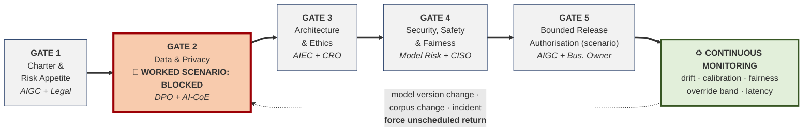

# 🧭 AI Governance for Credit Decisioning — Governing a High-Risk AI System End to End

> **Portfolio role:** AI Governance Lead / Governance Design Authority
> **System:** Credit Decisioning Assistant — hybrid deterministic scoring layer + RAG narration layer on Amazon Bedrock
> **Worked-scenario outcome:** Gate 2 blocks at a disparate impact ratio of **0.67** and clears at **0.89** after structural remediation
> **Scale:** 44 governance artefacts · 20 tracked risks · 18 failure modes · scenario sizing assumption of ~870,000 annual retail applicants
> **Lifecycle:** Five stage gates, dual-track — no technical milestone advances without its governance gate closing
> **Regimes:** EU AI Act Annex III(5)(b) high-risk · MAS TRM & FEAT · Singapore PDPA · GDPR Art.22

---

## 🎯 What I Designed / Delivered

- **Designed the dual-track operating model** — six lifecycle phases, five stage gates, 7 technical steps mapped to 15 parallel governance steps. Governance sequenced *ahead* of each phase rather than reviewing it afterwards.
- **Made the scoring/narration layer separation an explicit governance control.** The narration layer never produces the score — which is what keeps SHAP attribution valid, the GDPR Art.22 position defensible, and a deterministic fallback possible.
- **Introduced pre-declared fairness thresholds** and authored the mandatory proxy-attribute inference prompt (**Q2.4**: *"what can be inferred from this field that we do not intend to use?"*) as a blocking pre-ingestion question.
- **Modelled a Gate 2 block** three weeks before the scenario delivery date, designed the root-cause path into retrieval metadata, and **required the block record to remain permanently above its later release record**.
- **Specified IAM permission-layer enforcement** with a demonstrated denial required as pre-release evidence, plus a governed exception path — ordinary application code cannot invoke either model outside the approved control set.
- **Defined effectiveness-testing methods for 12 of 17 controls (71%)**; four are configuration-only and one is constrained/not implemented, rather than presenting design-time controls as operationally assured.
- **Built the 44-artefact ledger** with honest `Valid` / `Needs Extension` / `Recreated` status (3 / 13 / 28) and reported that ratio as a governance finding.

---

## ⚠️ Scope

**This is a worked governance blueprint, not a claim of live production deployment or hands-on operation of an AI platform.**

I designed the framework, the control set, the gate criteria and the artefact chain. I did not operate a production system. Dates, committee decisions and figures demonstrate how the framework *behaves* — internally consistent and defensible, not measured production KPIs.

An AI Governance Lead is accountable for what must be true *before* the engineering team builds. Drawing that line deliberately is the competence, not a concession.

---

## Why This Matters to the Business

| Business concern | Governance response | Evidence / control |
|---|---|---|
| Adverse-action letters too generic to defend under challenge | SHAP names the specific driver; mandatory passage-level citation ties it to a policy clause | A-19 Model Card · A-37 Recourse Procedure |
| Bias entering through surfaces model review doesn't inspect | Counterfactual pair testing, thresholds declared **before** execution; retrieval metadata treated as an input surface | A-15 Bias Testing Report · Q2.4 in A-08 |
| Deployments proceed because nobody can stop them | Five gates, named approvers, four-eyes rule enforced by automated check | A-28 Gate Approval Log — **worked scenario: 1 gate blocked, 2 use cases rejected** |
| Model risk invisible to a generative-only lens | 18 failure modes across both layers; 5 scoring-layer risks with named detection paths | A-09 Risk Register · A-10 FMEA |
| Conflicting obligations across four regimes | One control set mapped to 13 frameworks, divergences stated not absorbed | A-24 Compliance Tracker |
| Artefacts exist but evidence can't be traced to a decision | 44 artefacts with ID, version, accountable role, cross-references | MASTER_Artifact_Index.xlsx — **44/44, zero stale references** |

---

## Diagram 1 — End-to-End Enterprise Architecture

```mermaid
flowchart LR
    A["👤 Applicant<br/><i>scenario population</i>"] --> ORC["🔶 Orchestration<br/><i>deterministic ·<br/>no agentic surface</i>"]

    ORC --> SCORE["🔵 <b>SCORING LAYER</b><br/>Gradient-boosted model<br/><b>MAKES THE DECISION</b><br/>score + SHAP drivers"]
    ORC --> IN["🔴 Input Guardrail<br/><i>direct injection · denied topics · PII</i>"]
    IN --> RET["🟢 RAG Retrieval<br/>approved policy corpus<br/><i>version-pinned + hashed</i>"]
    RET --> RGC["🔴 Retrieved-Content Guardrail<br/><i>indirect injection · PII · poisoning checks</i>"]

    SCORE --> NAR
    RGC --> NAR["🟣 Narration Layer<br/>Amazon Bedrock<br/><b>ONLY EXPLAINS</b><br/><i>never produces the score</i>"]

    NAR --> OUT["🔴 Output Guardrail<br/><i>grounding ≥ 0.75 block-on-fail<br/>PII redaction before return + log</i>"]
    OUT --> HITL{"Human-in-the-Loop"}
    HITL -->|"marginal · adverse action ·<br/>low confidence · thin file · policy gap"| SR["Senior Underwriter<br/><i>mandatory escalation</i>"]
    HITL -->|"standard"| UW["Underwriter<br/>4 mandatory checks"]

    IAM["🔐 IAM Enforcement<br/><i>permission-layer control set<br/>governed exception path</i>"] -.-> SCORE
    IAM -.-> NAR

    OUT -.->|"grounding fail ·<br/>latency breach · retrieval down"| CB["⚡ Circuit breaker<br/><i>narration suppressed,<br/>score + SHAP still available</i>"]
    CB -.-> UW

    SR --> DEC["Decision + adverse<br/>action + recourse"]
    UW --> DEC
    DEC --> VAULT["🗄️ AUDIT VAULT<br/>prompt · citations · control trace<br/>model/prompt/corpus versions<br/>Object Lock · 7 years"]

    style SCORE fill:#BDD7EE,stroke:#1F4E79,stroke-width:4px
    style NAR fill:#E4DFEC,stroke:#5B2C87,stroke-width:2px
    style IN fill:#F8CBAD,stroke:#9C0006,stroke-width:2px
    style RGC fill:#F8CBAD,stroke:#9C0006,stroke-width:2px
    style OUT fill:#F8CBAD,stroke:#9C0006,stroke-width:2px
    style RET fill:#E2EFDA,stroke:#375623,stroke-width:2px
    style ORC fill:#FFF2CC,stroke:#BF8F00,stroke-width:2px
    style IAM fill:#D9EAF7,stroke:#1F4E79,stroke-width:2px
    style VAULT fill:#F2F2F2,stroke:#44546A,stroke-width:2px
    style CB fill:#FFE699,stroke:#BF8F00,stroke-width:2px
```

**The load-bearing decision:** the deterministic layer decides, the generative layer explains. Reverse that and the explainability chain collapses into an attribution problem nobody can solve.

---

## Evidence at a Glance

| Metric | Value | Derivation |
|---|---|---|
| Governance artefacts | **44 / 44** present, 0 stale references | Master index reconciliation, verified programmatically |
| Tracked enterprise risks | **20** (R-01 to R-20) | A-09, cross-traced to FMEA |
| Open risk position | **12 of 20** open by design — 9 monitored, 2 active, 1 accepted | A-09 SUMMARY-DASHBOARD; open by design because they materialise only in operation |
| Analysed failure modes | **18** (FM-01 to FM-18) | A-10, both architectural layers |
| Scenario population | **~870,000** annual retail applicants | Design assumption used for sizing/risk-tier analysis; not a measured production population |
| Worked fairness scenario | **DIR 0.67 → 0.89** | Simulated counterfactual pair testing; threshold pre-declared |
| Stage gates | **5** — worked scenario records 1 block, 0 bypasses | A-28 |
| Control test design | **71% (12/17) specified for effectiveness testing** | A-39 CONTROL-INDEX + A-11 VERIFICATION tab; 4 configuration-only, 1 constrained/not implemented |
| Governance maturity | **2.6 / 5** (self-assessment) | A-43, 15 dimensions |
| Independent assurance | **1 / 5** — lowest score in the set | No independent audit evidence exists |

> The uncomfortable figures matter most. **Until independent assurance tests this, the framework remains a design statement verified by its author rather than proof of production operating effectiveness** — and that qualifies every other score above it.

---

## Diagram 2 — Dual-Track Stage-Gate Lifecycle

---

## Consolidated Stage-Gate Summary

| Gate | Decision it answers | Authority | Outcome |
|---|---|---|---|
| **1** Charter & Risk Appetite | Permissible? At what tier? Can we operate it? | AIGC Chair + Legal | Worked scenario: approved as high-risk, dissent recorded; 2 other use cases rejected |
| **2** Data & Privacy | What data grounds it, and what can it infer? | DPO + AI-CoE | Worked scenario: 🚫 **block at 0.67** → ✅ clear at 0.89 after remediation |
| **3** Architecture & Ethics | Layer separation, HITL triggers, vendor obligations | AIEC Chair + CRO | Worked scenario: approved; no-agentic-surface recorded as a design decision |
| **4** Security, Safety & Fairness | Both layers evaluated? Adversarially tested? | Head of Model Risk + CISO | Worked scenario: approved; GDR-06 recorded *Constrained*, not *Outstanding* |
| **5** Bounded Release Authorisation | If implemented, may it carry traffic, at what scope, stoppable by whom? | AIGC + accountable business owner | Worked scenario: approved with a **500-application authorisation ceiling; not processed volume** |

*Four-eyes rule at every gate: no decision approved by the person who produced its evidence. Enforced by automated check in A-28.*

---

## 🚫 Signature Governance Decision — The Gate 2 Block

In the worked scenario, **counterfactual pair testing** uses 120 matched pairs / 240 synthetic profiles, with every financial variable held identical within each pair and only the investigated attribute varied. The design threshold — **DIR ≥ 0.80** using the four-fifths concept — is declared before the scenario test runs.

**The worked result is 0.67.** The scenario therefore records a Gate 2 block rather than moving the threshold after seeing the result. The exercise deliberately includes a realistic delivery-pressure argument — no demographic field in the scoring feature set and a committed date approaching — to test whether governance authority survives schedule pressure.

My contribution was to design the threshold, decision logic, evidence chain, diagnostic method and remediation path. The gate block, delivery pressure and release are worked-scenario behaviours, not meetings or production decisions I personally operated.

| | |
|---|---|
| **Root cause** | Postal district in **retrieval corpus metadata**, carried from a predecessor schema with no recorded purpose. The scoring feature set was clean — the disparity entered through the retrieval layer, the surface conventional model review doesn't inspect |
| **Diagnostic (worked scenario)** | Retrieval-chunk differential is modelled at **2.3×** for the four lowest-income segments. The outcome metric signals a problem; this diagnostic is used to locate the retrieval-side effect |
| **Remediation** | **Structural, not compensatory** — field deleted, address added to the redaction entity set so upstream reintroduction can't silently restore it, prompt constrained to exclude geography |
| **Re-test (worked scenario)** | **0.89.** Retrieval differential is modelled at 1.1; the scenario records release 11 days after the block |
| **Framework change** | Q2.4 became a mandatory written inference assessment for every field before ingestion |

**The design requires the blocked row to remain permanently above the later release row.** Removing it after remediation would erase the worked evidence that the gate can return “no”.

> The worked DPIA records that data minimisation was **not** satisfied at first design. The scenario is intentionally not rewritten to pretend governance caught the issue earlier than it did.

---

## Explainability & Hallucination Control

**Two layers, two techniques — and knowing which technique doesn't apply is the part that matters.**

| | Scoring layer | Narration layer |
|---|---|---|
| **Technique** | SHAP (global + local) · LIME (individual adverse-action cases) | Passage-level citation · grounding verification · relevance scoring |
| **Why it fits** | Structured scoring features directly drive the decision, making SHAP/LIME customer-actionable at this layer | The narration layer does not make the credit decision; source citation, support and grounding are the relevant assurance methods |
| **Deliberately not used as the credit-decision explanation** | — | **Token-level attribution of narration** — it does not explain the decision because the narration layer does not make it |

**Grounding floor ≥ 0.75 with block-on-fail.** A below-threshold narration is not shown at all, rather than flagged and passed to a human who will sometimes accept it under volume pressure.

**Detection is two controls, not one:**
- **Citation resolution** — does the cited passage exist and is it the one shown? Automated, absolute.
- **Citation support** — does that passage actually *say* what the rationale claims? Sampled, qualitative.

They fail independently. A citation can resolve correctly to an indexed passage that does not support the claim made from it. Treating resolution as sufficient is a common RAG governance gap.

---

## AI-Specific Threat Controls

Four domains that separate AI governance from conventional application security. Each maps to a named threat, a control, and the artefact that evidences it.

| Domain | Threat | Control | Evidence | Framework |
|---|---|---|---|---|
| **Prompt injection** | Direct and indirect — including malicious instructions embedded in retrieved content (T-01, T-02) | User input evaluated before retrieval; retrieved content evaluated again before entering the narration prompt; output checked before display/persistence. Adversarial cases cover direct, indirect, obfuscated and retrieval-borne attacks. System-prompt versioning/hashing (DET-02) is an integrity control, not a substitute for injection testing | A-39 · A-10 FM-09 | OWASP LLM01 · MITRE ATLAS evasion |
| **Retrieval-source governance** | Corpus poisoning; stale/unauthorised policy; proxy attributes entering through metadata (T-07) | Approved-source inventory with named owner, purpose, sensitivity, effective date, corpus/version ID, integrity hash, ingestion/change approval and lineage into the vector index; **mandatory Q2.4 inference assessment on every metadata field before ingestion**; corpus, metadata-schema, embedding/index, prompt-template and access-control changes trigger targeted re-evaluation | A-13 · A-14 · A-08 | OWASP LLM08 · EU AI Act Art.10 |
| **PII leakage** | Exposure through input, retrieved context, generated output or persisted audit evidence (T-03) | Tokenisation/masking at ingestion with separate re-identification-key custody; synthetic-PII effectiveness tests across input, retrieved context, generated output and persisted logs; six-entity redaction including Singapore NRIC/FIN applied before return **and before any record is written** (LOG-02) | A-13 · A-24 · A-35 | OWASP LLM02 · GDPR Art.32 · PDPA |
| **Human-in-the-loop** | Oversight decay under volume — the failure Art.14 exists to prevent (FM-13) | Four mandatory checks; routing on marginal score, adverse action, low confidence, thin file and policy gap; **two-sided override band 15–40%**; reviewer identity/timestamp/reason evidence; version-bound competency attestation; contested decisions routed to a **different underwriter who may disregard the AI narration entirely** | A-36 · A-38 · A-37 | EU AI Act Art.14 · GDPR Art.22(3) |

**The design point running through all four:** controls sit at the relevant trust boundary rather than relying on optional application behaviour. Redaction runs before persistence. Direct-injection checks run before retrieval, retrieved-content checks run before the narration prompt, and output checks run before display or logging. Oversight is measured two-sided because an unusually low override rate can indicate ceremonial review rather than high model quality. The Q2.4 proxy-inference question is asked before metadata enters the retrieval surface.

---

## Key Architectural Decisions

| Decision | Risk controlled | Evidence / artefact |
|---|---|---|
| Deterministic scoring decides; generative layer only explains | Unattributable decisions; GDPR Art.22 indefensibility | A-04 System Profile · A-19 Model Card |
| Enforcement at the IAM permission layer, not optional application logic | Ungoverned invocation — a control an application can silently omit is a convention | A-39 ENF-01; design requires demonstrated denial as pre-release evidence plus governed exception handling |
| Retrieval over fine-tuning | Fine-tuning alone does not provide the passage-level source traceability required for changing lending policy | A-16 Build vs Buy |
| Test partition held by Model Risk, not the build team | Validation-as-test contamination under deadline pressure | A-18 Model Registry |
| Two-sided override band (15–40%) | Oversight decay — a low override rate looks like quality, signals formality | A-30 Monitoring Policy · A-36 |
| Circuit breaker to deterministic fallback | Degraded-but-plausible narration reaching an underwriter | A-33 Rollback Log · A-44 BCP |
| Governed exception path for engineering | An unworkable control gets routed around, producing no evidence | A-21 AUP §5 |
| Ethics Committee: no veto, sunset clause | Governance theatre; unfalsifiable structures | A-42 Ethics Committee Charter |

---

## Interview Discussion Guide

**1. Why separate the scoring and narration layers?**
Because the structured scoring features directly drive the credit recommendation, so SHAP can explain the decision at the layer that actually makes it. The generative layer does not make the credit decision; it translates those validated drivers into policy-cited language and is assured through retrieval relevance, citation support and grounding.

**2. Why declare the fairness threshold before testing?**
Because a threshold set afterwards is a rationalisation. In the worked scenario, 0.80 exists before the simulated 0.67 result, so the governance response can be tested without moving the bar after seeing the outcome or introducing schedule pressure into the decision.

**3. How do you justify accepting residual risk?**
Twelve of twenty risks remain open by design: nine monitored, two active and one accepted. Many only become measurable during operation, so the governance design gives them named thresholds, owners and escalation rather than pretending they are closed. The one *accepted* residual risk names an individual accepting role, not the committee — collective acceptance can otherwise blur accountability.

**4. Your maturity score is 2.6/5. Why publish that?**
It is a deliberately conservative self-assessment of a framework exercised against one worked use case across an eight-month scenario timeline. Independent assurance scores 1/5 because no independent audit evidence exists. Publishing that limitation prevents design-time evidence from being misrepresented as operational maturity.

**5. Why keep the block record after remediation?**
Because a gate log containing only approvals cannot demonstrate effective challenge. In the worked scenario, the blocked row remains above the later release row so the evidence chain shows that the governance design can return “no”.

---

## Security-to-AI Governance Transfer

Twenty years of enterprise security governance transfers to AI more directly than the vocabulary suggests. IBM Guardium DAM and Tripwire FIM taught the same discipline this framework runs on: establish a baseline, monitor continuously, flag deviation, remediate on a cadence, and defend the evidence to an auditor. Enterprise IAM governance is where the permission-layer enforcement instinct comes from — a control that depends on an application choosing to apply it is a convention, and that lesson predates AI entirely. Change control, segregation of duties, four-eyes approval and evidence retention are unchanged; only the control plane moved, first to cloud infrastructure and now to AI systems. What is genuinely new is the inference surface — proxy attributes entering through retrieval metadata, oversight decaying under volume, a provider version change invalidating evidence you hold — and those are the gaps this framework was built to close.

---

<strong>📁 Full 44-Artefact Ledger</strong> — 3 Valid · 13 Needs Extension · 28 Recreated

Three `Valid` out of forty-four means a mature enterprise control estate transferred almost nothing directly to a high-risk AI deployment. That's not a criticism of the estate — it's the measurable cost of the obligation set.

| ID | Artefact | Lifecycle use |
|---|---|---|
| A-01 | AI Use Case Inventory | Create at intake; update on material scope change |
| A-02 | AI System Inventory Record | Create at intake; maintain through operation/retirement |
| A-03 | AI Risk Classification | Create at intake; revalidate on material change |
| A-04 | AI System Profile | Draft during architecture; baseline before release; update on change |
| A-05 | Stakeholder Impact Matrix | Create at intake; refine before approval and on material change |
| A-06 | Data & AI Governance Maturity Self-Assessment | Baseline early; reassess periodically |
| A-07 | Algorithmic Impact Assessment | Initiate early; complete before release; revisit on material change |
| A-08 | Risk Identification Checklist | Start at intake; refine through data and architecture design |
| A-09 | Enterprise AI Risk Register | Open at intake; update continuously through retirement |
| A-10 | AI FMEA | Start once data/architecture failure modes are visible; mature through control design |
| A-11 | Risk Treatment Plan | Create with first material risks; update through remediation/operation |
| A-12 | AI Risk Management Policy incl. Appetite Statement | Establish before threshold-based testing; maintain as policy |
| A-13 | Data Governance & Privacy Policy for AI | Create/refine before data ingestion; maintain through operation |
| A-14 | Data Lineage & Provenance Record | Create during data design; update with every material data/corpus change |
| A-15 | Algorithmic Explainability & Bias Testing Report | Define methods before testing; update after worked-scenario re-tests and, in future implementation, after material changes |
| A-16 | AI Vendor Assessment Plan (incl. Build vs Buy) | Initiate early; finalise during vendor/architecture selection; revisit on major change |
| A-17 | Foundation Model Vendor Due-Diligence Checklist | Complete before vendor approval; refresh periodically/on change |
| A-18 | AI Model Registry | Create when candidate/approved models exist; maintain by version |
| A-19 | System Model Card | Build during validation; baseline before release; update on retrain/material change |
| A-20 | Responsible AI Policy & Verification Guidelines | Establish early; apply throughout lifecycle |
| A-21 | Internal GenAI Acceptable Use Policy (governed systems) | Define during architecture/control design; enforce before release |
| A-22 | GenAI Acceptable Usage Policy (workforce) | Establish before workforce access; maintain thereafter |
| A-23 | AI Governance Policy (apex) | Establish governance baseline early; maintain as apex policy |
| A-24 | GenAI Policy Compliance Tracker | Start with control design; update through assurance/change |
| A-25 | AI Governance Strategy Document | Establish at programme initiation; revisit strategically |
| A-26 | AI Governance Committee Charter | Establish before gate decisions begin |
| A-27 | Implementation Roadmap | Baseline early; track variance through lifecycle |
| A-28 | Lifecycle Gate Approval Log | Initiate at Gate 1; append every gate decision/block/release |
| A-29 | Executive Briefing | Create after preliminary intake/classification; update for material decisions and release readiness |
| A-30 | Post-Deployment Monitoring & Review Policy | Design before release; operate and refine post-release |
| A-31 | Audit Charter | Define assurance independence/scope early; execute audit activity later |
| A-32 | AI Incident Response Playbook | Design/test before release; operate post-release |
| A-33 | Model Monitoring Dashboard & Rollback Log | Define signals/rollback before release; populate/operate after release |
| A-34 | AI Kill Switch & Emergency Suspension Provision | Design and evidence before release; invoke only if needed |
| A-35 | PANOPTIC Privacy Assessment & DPIA | Start before sensitive-data processing; update on material privacy change |
| A-36 | Human Oversight & Escalation Procedure | Define during architecture; validate before release; monitor thereafter |
| A-37 | Adverse Action & Customer Recourse Procedure | Design before release; operate for contested decisions |
| A-38 | AI Literacy & Competency Record | Establish before users/reviewers perform governed roles; maintain by version/role |
| A-39 | AI Red Teaming & Threat Matrix / Control Testing Index | Start threat modelling with architecture; mature testing before release; re-test on change |
| A-40 | Model Change & Deprecation Log | Start when governed model/prompt/corpus versions exist; maintain through retirement |
| A-41 | Decommissioning & Records Retention Plan | Define retention/retirement requirements before release; execute at retirement |
| A-42 | AI Ethics Committee Charter | Establish before ethics review begins; revisit if mandate changes |
| A-43 | Governance Maturity Tracker | Baseline and update periodically; not proof of independent assurance |
| A-44 | Business Continuity & Operational Resilience Playbook | Design/test before release; operate and exercise thereafter |

`Valid` — applied without structural modification · `Needs Extension` — pre-existing artefact augmented for GenAI/high-risk obligations · `Recreated` — newly constructed or fully rebuilt.

<strong>⚖️ 13-Framework Compliance Mapping</strong>

**Divergences stated rather than smoothed over:** conformity assessment and registration obligations under the EU AI Act have **no MAS equivalent**. Notification clocks run on different triggers and concurrently — a procedure planned to one will miss the other. MAS FEAT is supervisory guidance without direct penalty; the EU AI Act is binding law. They are not substitutes.

| Framework | Provisions engaged | Gate(s) | Evidencing artefacts |
|---|---|---|---|
| **EU AI Act** (Reg. (EU) 2024/1689) | Art.4 · Art.6 & Annex III(5)(b) · Art.9 · Art.10 · Art.11/Annex IV · Art.12 · Art.13 · Art.14 · Art.15 · Art.26 · Art.27 · Art.72 · Art.73 · Art.86 | 1–5 | A-03 · A-09 · A-15 · A-19 · A-30 · A-36 · A-37 · A-38 |
| **MAS TRM 2021** | Ch.3 · Ch.5 · Ch.8 · Ch.9 · Ch.10 · Ch.11.2 · Ch.13 | 1, 3, 5 | A-25 · A-17 · A-44 · A-31 · A-32 |
| **MAS FEAT** | Fairness · Ethics · Accountability · Transparency | 2, 3, 4 | A-15 · A-20 · A-28 · A-42 |
| **Singapore PDPA** | Protection · Accountability · Retention Limitation · Notification · Access & Correction | 2, 5 | A-13 · A-35 · A-37 · A-41 |
| **Model AI Governance Framework** | Internal governance · human involvement · operations mgmt · stakeholder interaction | 1, 4 | A-25 · A-36 · A-37 |
| **GDPR** | **Art.22** · Art.5 · Art.13–15 · Art.32 · Art.35 · Recital 71 | 2, 4 | A-35 · A-36 · A-37 · A-13 |
| **NIST AI RMF 1.0** | GOVERN · MAP · MEASURE 2.5/2.11 · MANAGE 4.1 | All | A-25 · A-08 · A-15 · A-30 |
| **ISO/IEC 42001:2023** | Cl.5 · Cl.6 · Cl.8 · Cl.9 · Cl.10 | 1, 4, 5 | A-23 · A-26 · A-31 · A-43 |
| **ISO/IEC 23053:2022** | ML lifecycle stages, components, stakeholder roles | 2, 3 | A-04 · A-19 · A-25 |
| **OWASP LLM Top 10 (2025)** | LLM01 · LLM02 · LLM05 · LLM06 · LLM07 · LLM08 | 4 | A-39 · A-10 |
| **MITRE ATLAS** | Evasion · exfiltration · supply chain | 4 | A-39 · A-10 |
| **CSA AI Security Guidance** | Data, model, application, infrastructure layers | 3, 5 | A-04 · A-24 |
| **CSA AI Controls Matrix** | Control domain coverage assessment | 4, 5 | A-39 · A-24 |

<strong>🛡️ Adversarial Threat Matrix</strong> — 12 threats, both layers

| Threat | Framework | Layer | Control | Residual |
|---|---|---|---|---|
| Prompt injection — direct | OWASP LLM01 · ATLAS evasion | Narration | User input evaluated before retrieval; direct/obfuscated attack suite; system-prompt integrity controlled separately | Novel patterns — quarterly refresh |
| Prompt injection — indirect | OWASP LLM01 | Narration | Retrieved content evaluated before entering the narration prompt; adversarial retrieval-borne test cases | As above |
| Sensitive information disclosure | OWASP LLM02 | Narration | Tokenisation/masking at ingestion; synthetic-PII tests across input/retrieval/output/log; six-entity redaction pre-output **and** pre-log | Low |
| Improper output handling | OWASP LLM05 | Orchestration | Output encoding at application boundary | Low |
| Excessive agency | OWASP LLM06 | Orchestration | No agentic tool surface | **Eliminated by design** |
| System prompt leakage | OWASP LLM07 | Narration | Prompt versioning/hashing for integrity plus leakage-oriented adversarial testing | Low |
| Vector store poisoning | OWASP LLM08 · ATLAS | Retrieval | Approved-source inventory, controlled corpus/index changes, integrity hashes and targeted re-evaluation | Low |
| **Model extraction** | ATLAS exfiltration | **Scoring** | Per-identity rate limiting; query-pattern alarm | Medium — monitored |
| **Membership inference** | ATLAS exfiltration | **Scoring** | Rate limiting; no per-record confidence exposure | Medium — monitored |
| Adversarial perturbation | ATLAS evasion | **Scoring** | Confidence thresholds; HITL routes marginal scores | Low — routed to human by design |
| Proxy discrimination | EU AI Act Art.10 · MAS FEAT | Retrieval | Q2.4 inference assessment; counterfactual testing | Bounded by test design |
| Ungoverned invocation | CSA AICM | Orchestration | Permission-layer enforcement; demonstrated denial required as pre-release evidence; governed exception path | **Zero appetite** — any occurrence is P1 |

---

**Author:** Arunkumar Devaraj — Cloud Security & AI Governance | CCSP | 20 years enterprise security (IBM Guardium DAM, Tripwire FIM, enterprise IAM governance), 12+ years multi-cloud | Transitioning into AI Governance Lead / Cloud Governance Lead roles.
