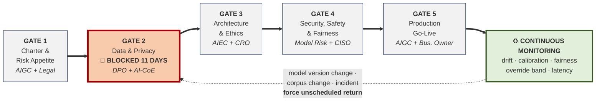

# 🧭 AI Governance for Credit Decisioning — Governing a High-Risk AI System End to End

> **Role:** AI Governance Lead & Principal AI Architect (design authority)
> **System:** Credit Decisioning Assistant — hybrid deterministic scoring layer + RAG narration layer on Amazon Bedrock
> **Signature outcome:** Blocked Gate 2 on a disparate impact ratio of **0.67**; released at **0.89** after structural remediation
> **Scale:** 44 governance artefacts · 20 tracked risks · 18 failure modes · ~870,000 annual retail applicants
> **Lifecycle:** Five stage gates, dual-track — no technical milestone advances without its governance gate closing
> **Regimes:** EU AI Act Annex III(5)(b) high-risk · MAS TRM & FEAT · Singapore PDPA · GDPR Art.22

---

## 🎯 What I Designed / Delivered

- **Designed the dual-track operating model** — six lifecycle phases, five stage gates, 7 technical steps mapped to 15 parallel governance steps. Governance sequenced *ahead* of each phase rather than reviewing it afterwards.
- **Made the scoring/narration layer separation an explicit governance control.** The narration layer never produces the score — which is what keeps SHAP attribution valid, the GDPR Art.22 position defensible, and a deterministic fallback possible.
- **Introduced pre-declared fairness thresholds** and authored the mandatory proxy-attribute inference prompt (**Q2.4**: *"what can be inferred from this field that we do not intend to use?"*) as a blocking pre-ingestion question.
- **Blocked Gate 2** three weeks from a committed date, drove root-cause analysis into retrieval metadata, and **retained the block record permanently above its release record**.
- **Specified IAM permission-layer enforcement** with a demonstrated denial captured as evidence — no application code path reaches either model ungoverned.
- **Established that 71% of controls are effectiveness-tested**, with the remaining 29% recorded as configuration-only rather than presented as assured.
- **Built the 44-artefact ledger** with honest `Valid` / `Needs Extension` / `Recreated` status (3 / 13 / 28) and reported that ratio as a governance finding.

---

## ⚠️ Scope

**This is a worked governance blueprint, not a claim of live production deployment or hands-on operation of an AI platform.**

I designed the framework, the control set, the gate criteria and the artefact chain. I did not operate a production system. Dates, committee decisions and figures demonstrate how the framework *behaves* — internally consistent and defensible, not measured production KPIs.

An AI Governance Lead is accountable for what must be true *before* the engineering team builds. Drawing that line deliberately is the competence, not a concession.

---

## Why This Matters to the Business

| Business concern | Governance response | Evidence / control |
|---|---|---|
| Adverse-action letters too generic to defend under challenge | SHAP names the specific driver; mandatory passage-level citation ties it to a policy clause | A-19 Model Card · A-37 Recourse Procedure |
| Bias entering through surfaces model review doesn't inspect | Counterfactual pair testing, thresholds declared **before** execution; retrieval metadata treated as an input surface | A-15 Bias Testing Report · Q2.4 in A-08 |
| Deployments proceed because nobody can stop them | Five gates, named approvers, four-eyes rule enforced by automated check | A-28 Gate Approval Log — **1 gate blocked, 2 use cases rejected** |
| Model risk invisible to a generative-only lens | 18 failure modes across both layers; 5 scoring-layer risks with named detection paths | A-09 Risk Register · A-10 FMEA |
| Conflicting obligations across four regimes | One control set mapped to 13 frameworks, divergences stated not absorbed | A-24 Compliance Tracker |
| Artefacts exist but evidence can't be traced to a decision | 44 artefacts with ID, version, accountable role, cross-references | MASTER_Artifact_Index.xlsx — **44/44, zero stale references** |

---

## Diagram 1 — End-to-End Enterprise Architecture

```mermaid
flowchart LR
    A["👤 Applicant<br/>~870k/yr"] --> ORC["🔶 Orchestration<br/><i>deterministic ·<br/>no agentic surface</i>"]

    ORC --> SCORE["🔵 <b>SCORING LAYER</b><br/>Gradient-boosted model<br/><b>MAKES THE DECISION</b><br/>score + SHAP drivers"]
    ORC --> RET["🟢 RAG Retrieval<br/>policy corpus<br/><i>version-pinned + hashed</i>"]

    SCORE --> GUARD
    RET --> GUARD

    GUARD["🔴 IAM GUARDRAILS<br/>permission-layer enforced<br/>6 controls · no bypass path<br/>grounding ≥ 0.75 block-on-fail"]

    GUARD --> NAR["🟣 Narration Layer<br/>Amazon Bedrock<br/><b>ONLY EXPLAINS</b><br/><i>never produces the score</i>"]

    NAR --> HITL{"Human-in-the-Loop"}
    HITL -->|"marginal · adverse action ·<br/>low confidence · thin file"| SR["Senior Underwriter<br/><i>mandatory escalation</i>"]
    HITL -->|"standard"| UW["Underwriter<br/>4 mandatory checks"]

    GUARD -.->|"grounding fail ·<br/>latency breach"| CB["⚡ Circuit breaker<br/><i>narration suppressed,<br/>score still served</i>"]
    CB -.-> UW

    SR --> DEC["Decision + adverse<br/>action + recourse"]
    UW --> DEC
    DEC --> VAULT["🗄️ AUDIT VAULT<br/>prompt · citations · control trace<br/>both model versions<br/>Object Lock · 7 years"]

    style SCORE fill:#BDD7EE,stroke:#1F4E79,stroke-width:4px
    style NAR fill:#E4DFEC,stroke:#5B2C87,stroke-width:2px
    style GUARD fill:#F8CBAD,stroke:#9C0006,stroke-width:3px
    style RET fill:#E2EFDA,stroke:#375623,stroke-width:2px
    style ORC fill:#FFF2CC,stroke:#BF8F00,stroke-width:2px
    style VAULT fill:#F2F2F2,stroke:#44546A,stroke-width:2px
    style CB fill:#FFE699,stroke:#BF8F00,stroke-width:2px
```

**The load-bearing decision:** the deterministic layer decides, the generative layer explains. Reverse that and the explainability chain collapses into an attribution problem nobody can solve.

---

## Evidence at a Glance

| Metric | Value | Derivation |
|---|---|---|
| Governance artefacts | **44 / 44** present, 0 stale references | Master index reconciliation, verified programmatically |
| Tracked enterprise risks | **20** (R-01 to R-20) | A-09, cross-traced to FMEA |
| Analysed failure modes | **18** (FM-01 to FM-18) | A-10, both architectural layers |
| Affected population | **~870,000** annual retail applicants | A-05, incl. vulnerable and thin-file cohorts |
| Fairness remediation | **DIR 0.67 → 0.89** | Counterfactual pair testing, threshold pre-declared |
| Stage gates | **5** — 1 blocked, 0 bypassed | A-28 |
| Control assurance | **71% effectiveness-tested** | A-39 CONTROL-INDEX + A-11 VERIFICATION tab |
| Governance maturity | **2.6 / 5** (self-assessment) | A-43, 15 dimensions |
| Independent assurance | **1 / 5** — lowest score in the set | Internal Audit has not completed a pass |

> The two figures I'd lead with are the uncomfortable ones. **Until a third line has tested this, the framework is a statement of what it intends, verified by its author** — and that qualifies every other score above it.

---

## Diagram 2 — Dual-Track Stage-Gate Lifecycle

---

## Consolidated Stage-Gate Summary

| Gate | Decision it answers | Authority | Outcome |
|---|---|---|---|
| **1** Charter & Risk Appetite | Permissible? At what tier? Can we operate it? | AIGC Chair + Legal | ✅ Approved as high-risk, dissent recorded. 2 other use cases rejected |
| **2** Data & Privacy | What data grounds it, and what can it infer? | DPO + AI-CoE | 🚫 **BLOCKED at 0.67** → ✅ released at 0.89, 11 days |
| **3** Architecture & Ethics | Layer separation, HITL triggers, vendor obligations | AIEC Chair + CRO | ✅ Approved. No-agentic-surface recorded as a design decision |
| **4** Security, Safety & Fairness | Both layers evaluated? Adversarially tested? | Head of Model Risk + CISO | ✅ Approved. GDR-06 recorded *Constrained*, not *Outstanding* |
| **5** Production Go-Live | May it carry traffic, at what scope, stoppable by whom? | AIGC + accountable business owner | ✅ Approved, **bounded at 500 applications** |

*Four-eyes rule at every gate: no decision approved by the person who produced its evidence. Enforced by automated check in A-28.*

---

## 🚫 Signature Governance Decision — The Gate 2 Block

Fairness testing used **counterfactual pair testing**: 120 matched pairs, 240 synthetic profiles, every financial variable held identical within each pair. Only the attribute under test varied. The threshold — **DIR ≥ 0.80** under the four-fifths rule — was written down before a single test ran.

**The result came back at 0.67.** Applicants with identical financial profiles were receiving different recommendations depending on residential postal district. No protected attribute had ever been supplied to either layer.

The delivery position was reasonable and is the argument made in every organisation: thirty percentage points across twelve planning areas, no demographic data in the feature set, committed date three weeks out. *This is small, it is not discrimination, and we do not have time.*

**I blocked the gate** — precisely because the threshold was pre-declared. 0.80 was chosen so the decision would not turn on a post-hoc judgement about what counts as small.

| | |
|---|---|
| **Root cause** | Postal district in **retrieval corpus metadata**, carried from a predecessor schema with no recorded purpose. The scoring feature set was clean — the disparity entered through the retrieval layer, the surface conventional model review doesn't inspect |
| **Diagnostic** | Retrieval-chunk differential: adverse-action guidance retrieved **2.3× more often** for the four lowest-income segments. The outcome metric proved a problem existed; this located it |
| **Remediation** | **Structural, not compensatory** — field deleted, address added to the redaction entity set so upstream reintroduction can't silently restore it, prompt constrained to exclude geography |
| **Re-test** | **0.89.** Retrieval differential fell to 1.1. Released 11 days after the block |
| **Framework change** | Q2.4 became a mandatory written inference assessment for every field before ingestion |

**The block record is retained permanently, above the release record.** Deleting it once remediated would erase the only evidence the framework has ever stopped anything.

> Recorded in the DPIA rather than smoothed over: data minimisation was **not** satisfied at first design. The framework worked — at the testing gate, one stage *after* the failure was introduced. The version where governance caught it at design review is a better story and a false one.

---

## Explainability & Hallucination Control

**Two layers, two techniques — and knowing which technique doesn't apply is the part that matters.**

| | Scoring layer | Narration layer |
|---|---|---|
| **Technique** | SHAP (global + local) · LIME (individual adverse-action cases) | Passage-level citation · grounding verification · relevance scoring |
| **Why it fits** | Fixed, enumerable feature vector — what Shapley values assume | No stable feature vector; inputs are tokens, output is prose |
| **Deliberately not used** | — | **SHAP / LIME** — attribution over tokens tells a declined applicant nothing actionable |

**Grounding floor ≥ 0.75 with block-on-fail.** A below-threshold narration is not shown at all, rather than flagged and passed to a human who will sometimes accept it under volume pressure.

**Detection is two controls, not one:**
- **Citation resolution** — does the cited passage exist and is it the one shown? Automated, absolute.
- **Citation support** — does that passage actually *say* what the rationale claims? Sampled, qualitative.

They fail independently. A citation can resolve correctly to an indexed passage that does not support the claim made from it. Treating resolution as sufficient is the commonest gap in RAG governance.

---

## Key Architectural Decisions

| Decision | Risk controlled | Evidence / artefact |
|---|---|---|
| Deterministic scoring decides; generative layer only explains | Unattributable decisions; GDPR Art.22 indefensibility | A-04 System Profile · A-19 Model Card |
| Enforcement at the IAM permission layer, not application code | Ungoverned invocation — a guardrail an app can skip is a convention | A-39 ENF-01 with demonstrated denial |
| Retrieval over fine-tuning | Uncitable knowledge locked in weights | A-16 Build vs Buy |
| Test partition held by Model Risk, not the build team | Validation-as-test contamination under deadline pressure | A-18 Model Registry |
| Two-sided override band (15–40%) | Oversight decay — a low override rate looks like quality, signals formality | A-30 Monitoring Policy · A-36 |
| Circuit breaker to deterministic fallback | Degraded-but-plausible narration reaching an underwriter | A-33 Rollback Log · A-44 BCP |
| Governed exception path for engineering | An unworkable control gets routed around, producing no evidence | A-21 AUP §5 |
| Ethics Committee: no veto, sunset clause | Governance theatre; unfalsifiable structures | A-42 Ethics Committee Charter |

---

## Interview Discussion Guide

**1. Why separate the scoring and narration layers?**
Because it determines which explainability techniques are legitimate. SHAP needs a fixed feature vector, which the generative layer doesn't have — so the deterministic model decides and SHAP explains it, while the LLM narrates that attribution with passage-level citations.

**2. Why declare the fairness threshold before testing?**
Because a threshold set afterwards isn't a threshold, it's a rationalisation. 0.80 was written down first specifically so the 0.67 result couldn't be argued down as "small" when the deadline pressure arrived — and that's exactly what was attempted.

**3. How do you justify accepting residual risk?**
Seven risks remain open because they only materialise in production and are managed by measurement with named thresholds and escalation. The one *accepted* residual risk names an individual accepting role, not the committee — a risk accepted collectively is a risk nobody owns.

**4. Your maturity score is 2.6/5. Why publish that?**
It's the correct number for a framework proven on one system over eight months, and independent assurance scores 1/5 because Internal Audit hasn't passed. A framework claiming 4s across the board is telling you the assessor had no incentive to find anything.

**5. Why keep the block record after remediation?**
Because it's the only evidence the framework has ever stopped anything. A gate log showing only approvals cannot demonstrate the gate is real — the blocked row sits permanently above its release row for exactly that reason.

---

## Security-to-AI Governance Transfer

Twenty years of enterprise security governance transfers to AI more directly than the vocabulary suggests. IBM Guardium DAM and Tripwire FIM taught the same discipline this framework runs on: establish a baseline, monitor continuously, flag deviation, remediate on a cadence, and defend the evidence to an auditor. Enterprise IAM governance is where the permission-layer enforcement instinct comes from — a control that depends on an application choosing to apply it is a convention, and that lesson predates AI entirely. Change control, segregation of duties, four-eyes approval and evidence retention are unchanged; only the control plane moved, first to cloud infrastructure and now to AI systems. What is genuinely new is the inference surface — proxy attributes entering through retrieval metadata, oversight decaying under volume, a provider version change invalidating evidence you hold — and those are the gaps this framework was built to close.

---

<strong>📁 Full 44-Artefact Ledger</strong>

Three `Valid` out of forty-four means a mature enterprise control estate transferred almost nothing directly to a high-risk AI deployment. That's not a criticism of the estate — it's the measurable cost of the obligation set.

| ID | Artefact | Phase |
|---|---|---|
| A-01 | AI Use Case Inventory | 1 | 
| A-02 | AI System Inventory Record | 1, 6 | 
| A-03 | AI Risk Classification | 1 |
| A-04 | AI System Profile | 3 | 
| A-05 | Stakeholder Impact Matrix | 1 | 
| A-06 | Data & AI Governance Maturity Self-Assessment | 1, 6 |
| A-07 | Algorithmic Impact Assessment | 4 |
| A-08 | Risk Identification Checklist | 1–3 | 
| A-09 | Enterprise AI Risk Register | 1–6 | 
| A-10 | AI FMEA | 3, 4 | 
| A-11 | Risk Treatment Plan | 2–6 | 
| A-12 | AI Risk Management Policy incl. Appetite Statement | 1 |
| A-13 | Data Governance & Privacy Policy for AI | 2 | 
| A-14 | Data Lineage & Provenance Record | 2 | 
| A-15 | Algorithmic Explainability & Bias Testing Report | 2, 4, 6 | 
| A-16 | AI Vendor Assessment Plan (incl. Build vs Buy) | 1, 3 | 
| A-17 | Foundation Model Vendor Due-Diligence Checklist | 3 | 
| A-18 | AI Model Registry | 3, 6 | 
| A-19 | System Model Card | 4 | 
| A-20 | Responsible AI Policy & Verification Guidelines | 1–6 | 
| A-21 | Internal GenAI Acceptable Use Policy (governed systems) | 3, 5 | 
| A-22 | GenAI Acceptable Usage Policy (workforce) | 5 | 
| A-23 | AI Governance Policy (apex) | 1 | 
| A-24 | GenAI Policy Compliance Tracker | 3, 4 | 
| A-25 | AI Governance Strategy Document | 1 |
| A-26 | AI Governance Committee Charter | 1 |
| A-27 | Implementation Roadmap | 1–6 |
| A-28 | Lifecycle Gate Approval Log | 1–6 |
| A-29 | Executive Briefing | 1–6 |
| A-30 | Post-Deployment Monitoring & Review Policy | 6 |
| A-31 | Audit Charter | 1, 6 |
| A-32 | AI Incident Response Playbook | 5, 6 |
| A-33 | Model Monitoring Dashboard & Rollback Log | 6 |
| A-34 | AI Kill Switch & Emergency Suspension Provision | 5 |
| A-35 | PANOPTIC Privacy Assessment & DPIA | 2 |
| A-36 | Human Oversight & Escalation Procedure | 3, 5 |
| A-37 | Adverse Action & Customer Recourse Procedure | 5 |
| A-38 | AI Literacy & Competency Record | 5 |
| A-39 | AI Red Teaming & Threat Matrix / Control Testing Index | 4 |
| A-40 | Model Change & Deprecation Log | 6 |
| A-41 | Decommissioning & Records Retention Plan | 6 |
| A-42 | AI Ethics Committee Charter | 1 |
| A-43 | Governance Maturity Tracker | 6 |
| A-44 | Business Continuity & Operational Resilience Playbook | 5 |

<strong>⚖️ 13-Framework Compliance Mapping</strong>

**Divergences stated rather than smoothed over:** conformity assessment and registration obligations under the EU AI Act have **no MAS equivalent**. Notification clocks run on different triggers and concurrently — a procedure planned to one will miss the other. MAS FEAT is supervisory guidance without direct penalty; the EU AI Act is binding law. They are not substitutes.

| Framework | Provisions engaged | Gate(s) | Evidencing artefacts |
|---|---|---|---|
| **EU AI Act** (Reg. (EU) 2024/1689) | Art.4 · Art.6 & Annex III(5)(b) · Art.9 · Art.10 · Art.11/Annex IV · Art.12 · Art.13 · Art.14 · Art.15 · Art.26 · Art.27 · Art.72 · Art.73 · Art.86 | 1–5 | A-03 · A-09 · A-15 · A-19 · A-30 · A-36 · A-37 · A-38 |
| **MAS TRM 2021** | Ch.3 · Ch.5 · Ch.8 · Ch.9 · Ch.10 · Ch.11.2 · Ch.13 | 1, 3, 5 | A-25 · A-17 · A-44 · A-31 · A-32 |
| **MAS FEAT** | Fairness · Ethics · Accountability · Transparency | 2, 3, 4 | A-15 · A-20 · A-28 · A-42 |
| **Singapore PDPA** | Protection · Accountability · Retention Limitation · Notification · Access & Correction | 2, 5 | A-13 · A-35 · A-37 · A-41 |
| **Model AI Governance Framework** | Internal governance · human involvement · operations mgmt · stakeholder interaction | 1, 4 | A-25 · A-36 · A-37 |
| **GDPR** | **Art.22** · Art.5 · Art.13–15 · Art.32 · Art.35 · Recital 71 | 2, 4 | A-35 · A-36 · A-37 · A-13 |
| **NIST AI RMF 1.0** | GOVERN · MAP · MEASURE 2.5/2.11 · MANAGE 4.1 | All | A-25 · A-08 · A-15 · A-30 |
| **ISO/IEC 42001:2023** & **ISO/IEC 38507:2022** | Cl.5 · Cl.6 · Cl.8 · Cl.9 · Cl.10 | 1, 4, 5 | A-23 · A-26 · A-31 · A-43 |
| **ISO/IEC 23053:2022** | ML lifecycle stages, components, stakeholder roles | 2, 3 | A-04 · A-19 · A-25 |
| **OWASP LLM Top 10 (2025)** | LLM01 · LLM02 · LLM05 · LLM06 · LLM07 · LLM08 | 4 | A-39 · A-10 |
| **MITRE ATLAS** | Evasion · exfiltration · supply chain | 4 | A-39 · A-10 |
| **CSA AI Security Guidance** | Data, model, application, infrastructure layers | 3, 5 | A-04 · A-24 |
| **CSA AI Controls Matrix** | Control domain coverage assessment | 4, 5 | A-39 · A-24 |

<strong>🛡️ Adversarial Threat Matrix</strong> — 12 threats, both layers

| Threat | Framework | Layer | Control | Residual |
|---|---|---|---|---|
| Prompt injection — direct | OWASP LLM01 · ATLAS evasion | Narration | Prompt-attack filtering; deterministic system prompt | Novel patterns — quarterly refresh |
| Prompt injection — indirect | OWASP LLM01 | Narration | Input evaluated before retrieval; guardrail ordering | As above |
| Sensitive information disclosure | OWASP LLM02 | Narration | Six-entity PII redaction pre-output **and** pre-log | Low |
| Improper output handling | OWASP LLM05 | Orchestration | Output encoding at application boundary | Low |
| Excessive agency | OWASP LLM06 | Orchestration | No agentic tool surface | **Eliminated by design** |
| System prompt leakage | OWASP LLM07 | Narration | Prompt versioned and hashed | Low |
| Vector store poisoning | OWASP LLM08 · ATLAS | Retrieval | Corpus change as controlled event; monthly hash check | Low |
| **Model extraction** | ATLAS exfiltration | **Scoring** | Per-identity rate limiting; query-pattern alarm | Medium — monitored |
| **Membership inference** | ATLAS exfiltration | **Scoring** | Rate limiting; no per-record confidence exposure | Medium — monitored |
| Adversarial perturbation | ATLAS evasion | **Scoring** | Confidence thresholds; HITL routes marginal scores | Low — routed to human by design |
| Proxy discrimination | EU AI Act Art.10 · MAS FEAT | Retrieval | Q2.4 inference assessment; counterfactual testing | Bounded by test design |
| Ungoverned invocation | CSA AICM | Orchestration | Permission-layer enforcement; demonstrated denial | **Zero appetite** — any occurrence is P1 |

---

**Author:** Arunkumar Devaraj — Cloud Security & AI Governance | CCSP | 20 years enterprise security (IBM Guardium DAM, Tripwire FIM, enterprise IAM governance), 12+ years multi-cloud | Transitioning into AI Governance Lead / Cloud Governance Lead roles.
